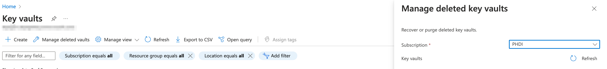

# DevOps

This doc offers detailed information about the features of the starter kit related to DevOps.

- [Continuous Integration and Continuous Deployment (CI/CD)](#continuous-integration-and-continuous-deployment-cicd)
  - [Continuous Integration (CI)](#continuous-integration-ci)
  - [Continuous Deployment (CD)](#continuous-deployment-cd)
  - [Table of CI/CD Pipelines](#table-of-cicd-pipelines)
- [Environments](#environments)
- [New Releases](#new-releases)
- [Tearing Down An Environment](#tearing-down-an-environment)
## Continuous Integration and Continuous Deployment (CI/CD)

We have implemented CI/CD pipelines with [GitHub Actions](https://docs.github.com/en/actions) orchestrated by [GitHub Workflows](https://docs.github.com/en/actions/using-workflows/about-workflows) found in the `phdi-azure/.github/` directory.

### Continuous Integration (CI)

The pre-merge CI pipeline can be found in [`phdi-azure/.github/workflows/testPython.yaml`](https://github.com/CDCgov/phdi-azure/blob/main/.github/workflows/testPython.yaml) It runs every time a Pull Request is opened and whenever additional changes are pushed to a branch. Currently, the following steps are included in this CI pipeline:

1. Identify all directories containing an Azure Function.
2. Run the unit tests for each Azure Function.
3. Check that all Python code complies with Black and Flake8.
4. Check that all Terraform code is formatted properly.

After merging, an end-to-end test is run against the `main` branch. This test can be found in `phdi-azure/.github/workflows/end-to-end.yaml`. This test runs sample data against a pipeline set up in an Azure development environment, and validates that the pipeline performed as intended.

### Continuous Deployment (CD)

Our deployment pipeline is defined in the YAML file `phdi-azure/.github/workflows/deployment.yaml`. Generally, this pipeline runs every time code is merged into the `main` branch of the repository, deploying to the `dev` environment. The pipeline can also be triggered manually to deploy to other environments, and a successful deployment to a development environment could be required before deploying to a production environment. When the pipeline runs, Terraform looks for differences between the infrastructure that is specified on a given branch of this repository and what is currently deployed to a given environment in the Azure resource group. If differences are detected, they are resolved by making changes to Azure resources to bring them alignment with the repository. In order to grant the GitHub repository permission to make these changes, follow [these instructions](https://learn.microsoft.com/en-us/azure/active-directory/develop/workload-identity-federation-create-trust?pivots=identity-wif-apps-methods-azp#github-actions) to authenticate it with Azure.

### Environments

The deployment pipeline is capable of deploying the starter kit to any number of environments. This allows users to flexibly configure however many distinct instances of the starter kit they need (dev, test, staging, prod, etc.). Currently all environments are deployed within a single Azure resource group. The environment name is included in the names of individual resources to distinguish which environment they belong to. If the starter kit is initially deployed by following the [Implementation Guide](implementation-guide.md), as recommended, it will only have a `dev` environment. To create additional environments follow the steps below:
1. Navigate to `Settings` on your version of the `phdi-azure` repository in GitHub.
2. Click on `Environments` in the side bar.
3. Click on `New Environment` in the top right.

4. Enter the name of your new environment and click `Configure environment`.


After following these steps to initialize a new environment see the [Deployments](#deployments) sections below for guidance on how to deploy the starter kit to it.

### Deployments

As mentioned in [Continuous Deployment (CD)](#continuous-deployment-cd) the deployment process for the starter kit is completely automated. By default any time code is merged into the `main` branch of the repository a deployment to the `dev` environment is automatically triggered. Deployments may also be triggered manually from any branch to any environment. This allows for easy deployment to development environments to during initial development and testing of new features. Additionally, after successful testing of `main` in a development environment, changes can easily be promoted to higher level environments (e.g. testing, production). To manually trigger a deployment follow the steps below.

1. Navigate to `Actions` on your version of the `phdi-azure` repository in GitHub.
2. Select the `Deployment` workflow from the menu of the left.

3. Open the `Run workflow` menu in the top right.
4. Select the branch you would like to deploy from.
5. Select the environment you would like to deploy to.
6. Click the green `Run workflow` button.


### Table of CI/CD Pipelines

| Pipeline Name   | Purpose                                                                                                                  | Trigger                                                                         | Notes                                                                                                                       |
|-----------------|--------------------------------------------------------------------------------------------------------------------------|---------------------------------------------------------------------------------|-----------------------------------------------------------------------------------------------------------------------------|
| testPython      | Run unit and linting tests on all Python source code in the repository, primarily the `read-source-data` Azure Function. | All pull request actions, pushes to `main`, and manually.                       | Unit test with Pytest. Linting with Black and Flake8.                                                                       |
| terraformChecks | Ensure all Terraform code is valid and properly linted.                                                                  | All pull request actions if they involve changes in `terraform/`, and manually. | `terraform fmt` for linting and `terraform validate` for validation.                                                        |
| deployment      | Deploy the starter kit from a branch to a given environment.                                                             | Pushes to `main` and manually.                                                  | Pushes to `main` trigger a deploy to the `dev` environment. This behavior can be changed as desired.                        |
| terraformSetup  | Create a storage account for storing the state of every environment deployed in the Azure resource group.                | Manual                                                                          | This workflow should only be run once for initial setup.                                                                    |
| end-to-end      | Run end-to-end tests to ensure the pipeline functions as expected within Azure.                                          | Pushes to `main`, or manually.                                                  | Verify the pipeline records the correct number of successes and failures and that data can be queried from the FHIR server. |
| destroy         | Destroy an environment within Azure.                                                                                     | Manual                                                                          | Destroys a given Terraform environment.                                                                                     |

## New Releases
It's important to keep your repository up-to-date with version changes from the main `phdi` repository. Even if you're not using new features of the services, staying up to date is a security best practice.

To update, visit the [main phdi repository](https://github.com/CDCgov/phdi) and copy the [latest version number](https://github.com/CDCgov/phdi/releases). Update the container image tag in [`main.tf`](https://github.com/CDCgov/phdi-azure/blob/main/terraform/modules/shared/main.tf#L201-L201).

We recommend doing this update at least monthly, and deploying every time an update is made.

## Tearing Down an Environment

To tear down an environment in Azure and clean up all associated resources, follow the steps outlined below:

### 1. Connect Local to Azure and Configure Terraform

To begin, make sure you have connected your local development environment to Azure and properly configured Terraform. Refer to the "Local Development" readme for instructions on setting up your local environment.

### 2. Access the Azure Portal

Visit the Azure portal (https://portal.azure.com) and sign in with your Azure credentials.

### 3. Select the Resource Group

Locate and select the resource group that contains the environment you want to tear down. Resource groups serve as logical containers for grouping related resources.


### 4. Filter and Delete the Workspace

Within the selected resource group, apply the appropriate filters to identify the workspace you wish to delete. Once you have located the target workspace, select it and choose the "Delete" option. Confirm the deletion when prompted.


### 5. Review Terraform States

Next, open your command-line interface (CLI) and navigate to the directory where your Terraform configuration files are stored. Run the command `terraform state list` to display a list of all the Terraform states associated with the environment.

### 6. Remove Terraform States

To remove each Terraform state individually, execute the command `terraform state rm {name of state}` in the CLI. If you want to remove multiple states at once, you can specify them using the format `terraform state rm {name}.{name}`.

### 7. Purge Key Vault

Navigate to the Azure Key Vault service in the Azure portal. Within the Key Vault management interface, locate and select "Manage deleted vaults" in the menu. Choose the appropriate subscription, and then purge the key vault associated with the workspace you are tearing down.


### 8. Environment Teardown Complete

Once you have followed all the steps outlined above, you have successfully torn down the environment and cleaned up all relevant resources. You are now free to re-deploy or make any necessary changes to the environment as needed.

Please note that tearing down an environment permanently removes all associated resources, and this action cannot be undone. Ensure that you have backed up any important data or configurations before proceeding with the teardown process.

## Maintenance

### Upgrading the PHDI Version

When a new version of PHDI is availble, the version used by `phdi-azure` can be updated by doing the following steps.

#### Upgrade Steps

1. Create a new branch for the upgrade.

2. Open the `terraform/modules/shared/main.tf` in a text editor of your choice.

3. Within the file, search for the code block that starts with `data "docker_registry_image" "ghcr_data" {`.

4. In the `name` field of the code block, you will find the current version number specified. Modify the version number to the desired new version.

   Example:
   ```hcl
   data "docker_registry_image" "ghcr_data" {
     for_each = local.images
     name     = "ghcr.io/cdcgov/phdi/${each.key}:v1.0.5"
   }
   ```

   Change the version number to the desired new version:
   ```hcl
   data "docker_registry_image" "ghcr_data" {
     for_each = local.images
     name     = "ghcr.io/cdcgov/phdi/${each.key}:v1.0.6"
   }
   ```

5. Save the `main.tf` file after making the necessary modifications.

6. Commit and push the branch to your repository.

7. Open a new PR for your branch to `main`.

8. After merging your PR, `dev` will be automatically deployed from the `main` branch. Other environments can be deployed with the updated `main` via github actions.
