# Azure Error Investigation Guide

- [Azure Error Investigation Guide](#azure-error-investigation-guide)
    - [Overview](#overview)
    - [Azure Data Factory Studio](#azure-data-factory-studio)
      - [Getting to the Studio](#getting-to-the-adf-studio)
      - [Monitoring your pipeline runs and diagnosing issues](#monitoring-your-pipeline-runs-and-diagnosing-issues)
      - [Troubleshooting pipeline configuration issues](#troubleshooting-pipeline-configuration-issues)
    - [Observing Pipeline Failure Trends using the Dashboard](#observing-pipeline-failure-trends-using-the-dashboard)

## Overview
This guide provides an overview of basic pipeline failure troubleshooting in Microsoft Azure. It assumes a user
has an account with full access to their Azure environment and basic familiarity with some Azure concepts. Full
Azure docs can be found [here.](https://learn.microsoft.com/en-us/azure/?product=popular)

## Azure Data Factory Studio
Our primary window into what's happening in our pipelines is the Azure Data Factory Studio. It provides a GUI
allowing management, monitoring, and editing of pipelines in a resource group without having to redeploy. This tool is 
where most of our Azure troubleshooting will take place, though it can be a bit tough to find.

### Getting to the ADF Studio
Start by navigating to Azure and logging in to your account. Once you've done that
follow the steps below.
 
 
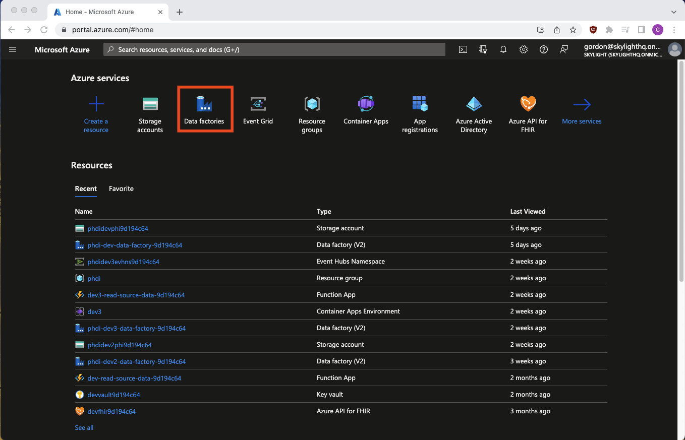
<figcaption align = "center">From the Azure homepage, search at the top for data factories and select it from the dropdown.
</figcaption>

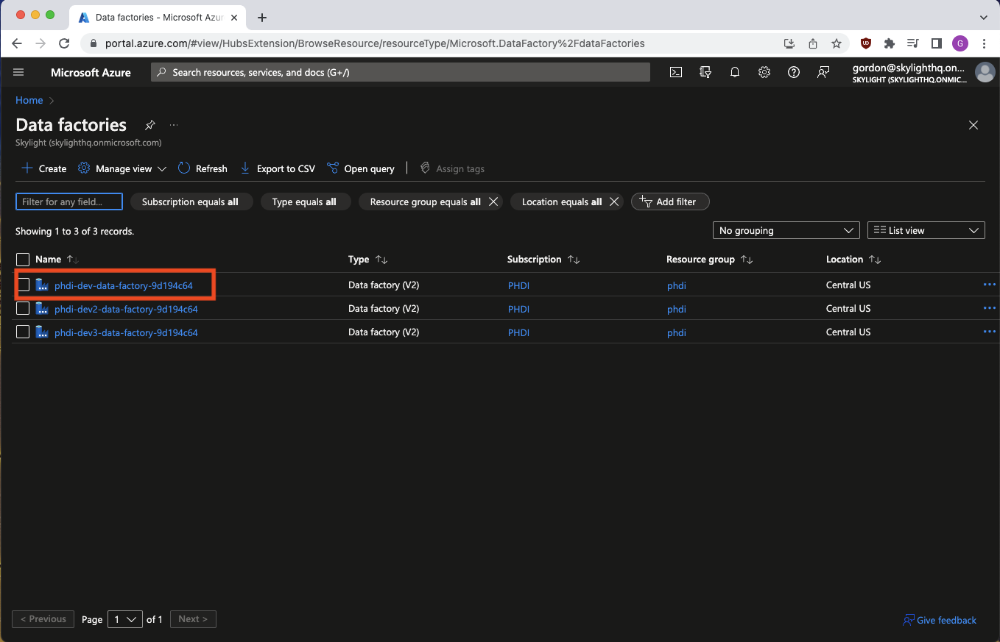
<figcaption align = "center">Select the Data Factory that contains the pipeline you want to troubleshoot.
</figcaption>

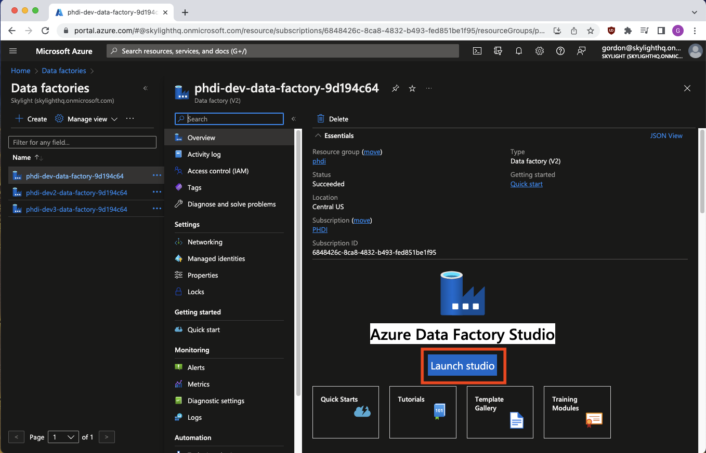
<figcaption align = "center">Click Launch Studio.
</figcaption>

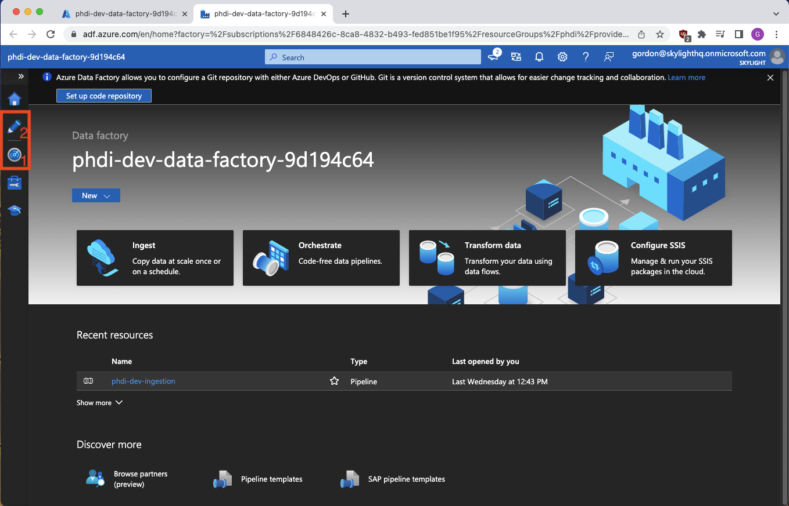
<figcaption align = "left">We're now in the Azure Data Factory Studio, and we have two options of where to go depending
on if we're primarily troubleshooting pipeline run failures or pipeline configuration issues.
The radar icon marked #1 opens a pipeline monitoring tool while the pencil at #2 opens an interface
allowing pipeline config edits. Let's look at monitoring first.
</figcaption>

### Monitoring your pipeline runs and diagnosing issues
Clicking the radar button takes us to the following informative page.

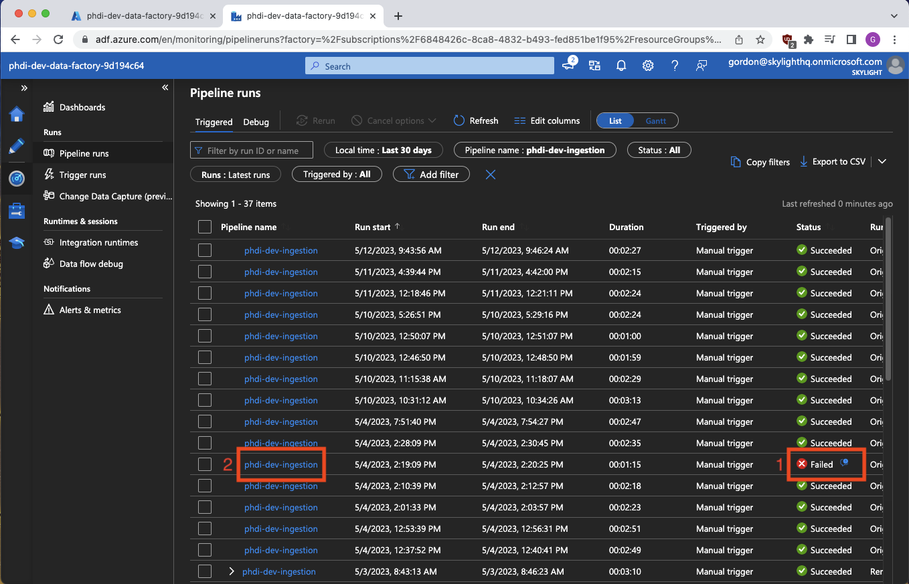
<figcaption align = "left">Here we can see and sort all pipeline runs. The status column gives us
at-a-glance feedback for if we've had any issues. Orange box #1 is an example
of a failed pipeline run. This is also the first place where we can see some error
messaging by clicking the small blue icon by the word "Failed". However, I don't recommend 
troubleshooting from here as the error formatting is poor and we're lacking important context.
Clicking the link in orange box #2 takes us to a much more detailed view of the failed run.
</figcaption>

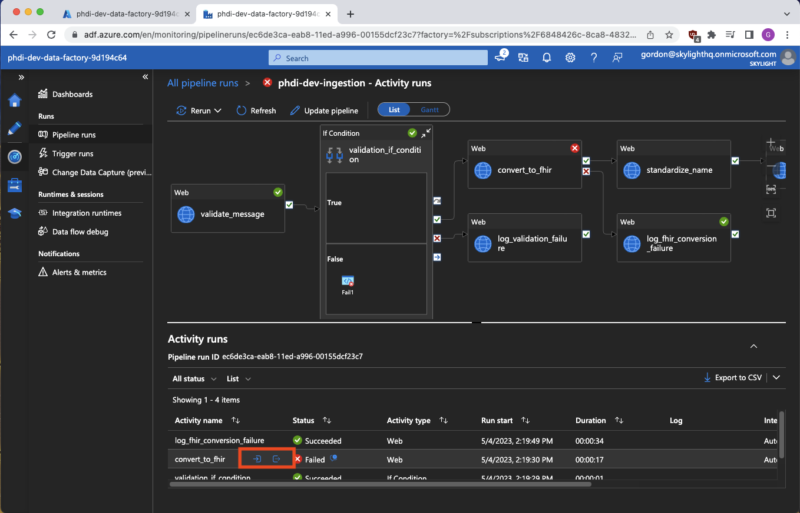
<figcaption align = "left">This is the most useful page for beginning a diagnosis of a failed pipeline run. We have full context showing us exactly
which steps succeeded or failed, and, most importantly, inputs and outputs of the failed step. The inputs/outputs are shown
by clicking the small blue icons highlighted in the orange box. However, you won't see these icons on initial page load because, for some
reason, Azure decided they should only appear on hover or click of the failed step in the lower list. The blue output icon
on the right will contain the most readably formatted version of the failure error you can find, and inputs from the left
blue icon can be checked against expected values.
</figcaption>

### Troubleshooting pipeline configuration issues
Pipeline configuration problems can be somewhat trickier to track down, and generally use a combination of the ADF studio
monitoring page we explored in the last section, and the Author page found through the aforementioned pencil icon. Let's
go there now.

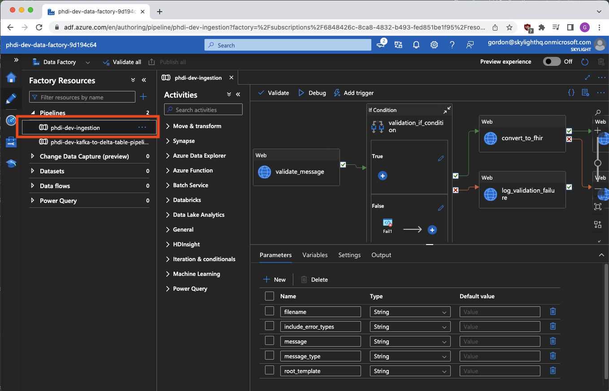
<figcaption align = "left">Once you've clicked the pencil and gotten to the Author tool, select your pipeline on the left to get this detailed view.
This page is extremely powerful and gives us complete control over examining and editing the pipeline configuration without
having to make changes in an IDE, pushing, and redeploying the entire pipeline. A handy graphical representation of our 
pipeline shows us how everything is related as well as general pipeline config such as params and variables in the bottom middle.
</figcaption>

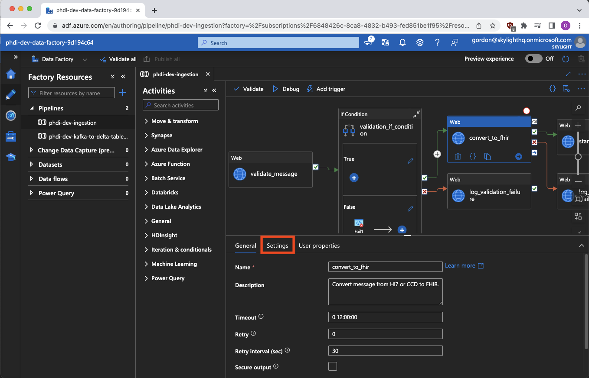
<figcaption align = "left">Clicking a particular pipeline step highlights it in blue and changes the lower portion of the page into a detailed job
view. Here we can tinker with individual settings and try changes to fix issues which might arrive. The settings tab in
particular (highlighted in orange) can help us get a better idea of what a job is up to.
</figcaption>

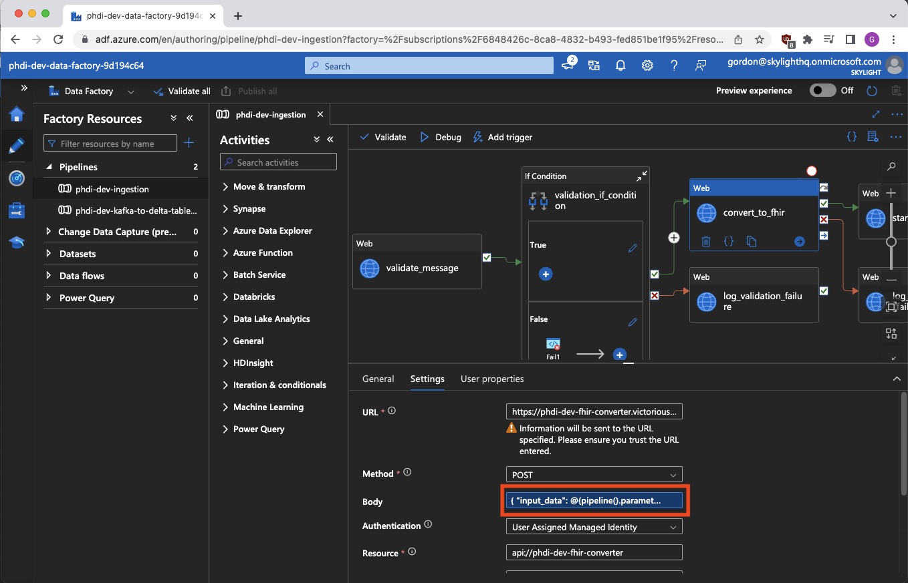
<figcaption align = "left">These settings are where you're most likely to find something about a particular pipeline step misconfigured. Here we
can see if it's hitting the right URL, using the right method, how the request body is being formed, headers, and 
credentials. Clicking a particular field will allow you to make changes or, in some cases, take you to a detailed edit view.
</figcaption>

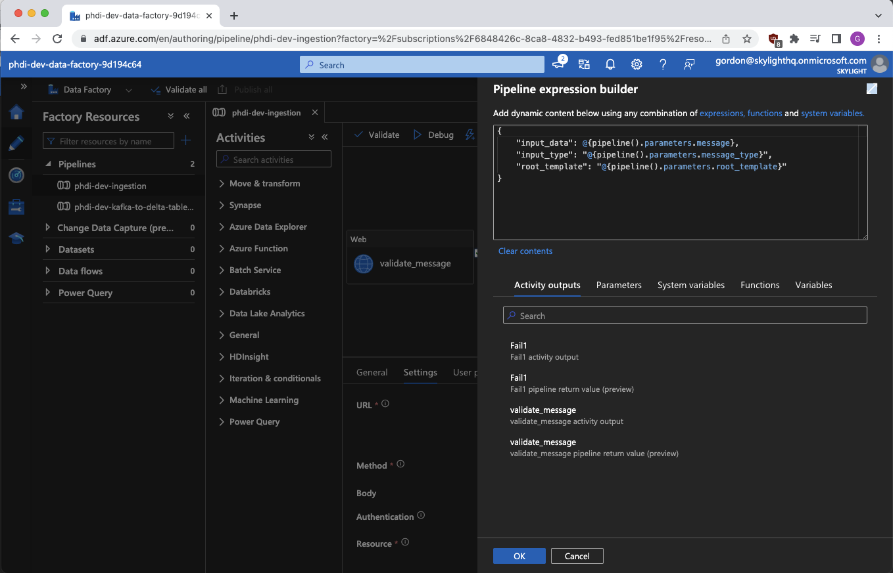
<figcaption align = "center">For example this edit view for the body field is both more readable and where we can actively adjust these values.
</figcaption>

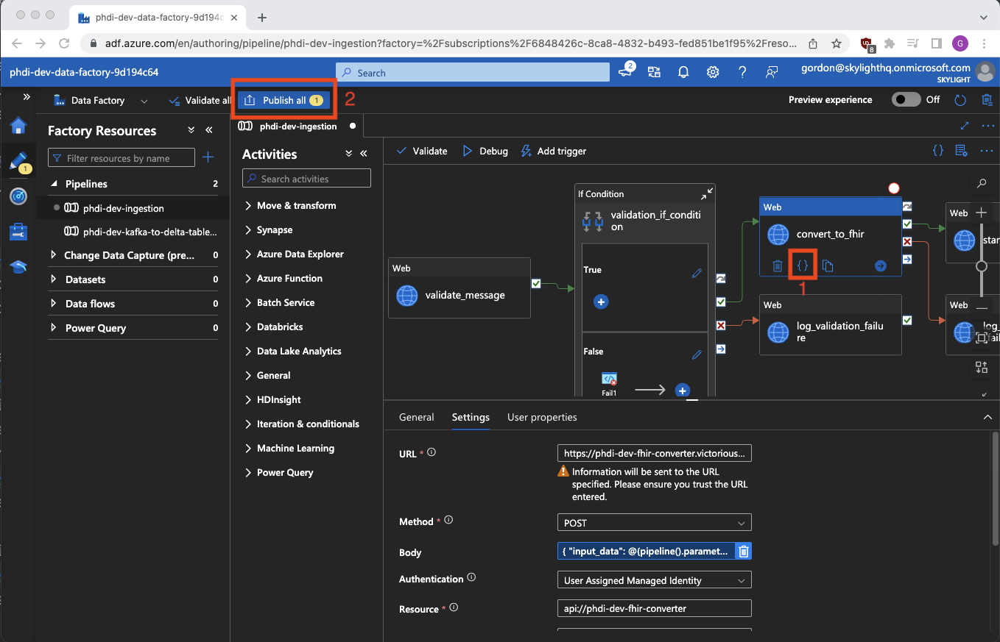
<figcaption align = "left">Two final important notes for the Author section of ADF Studio: First, orange box 1 highlights a pair of curly braces you can click to see the source code of a particular
step in the pipeline. While you can't edit from this view, it does put all the info for a step in front of you in a format
similar to the Terraform config files you might be comparing to in your IDE. Second, orange box 2 highlights the publish button.
Any changes you make in the author tool are only a draft until you click here, at which point they are put into effect immediately.
BE CAREFUL. The author tool is powerful and you can very easily <b><i>break things</i></b> in your pipeline.
</figcaption>

## Observing Pipeline Failure Trends Using the Dashboard
Our deployment script also automatically sets up a monitoring dashboard in Azure giving visibility into pipeline pass/fail
trends over time. To access this use the following directions.

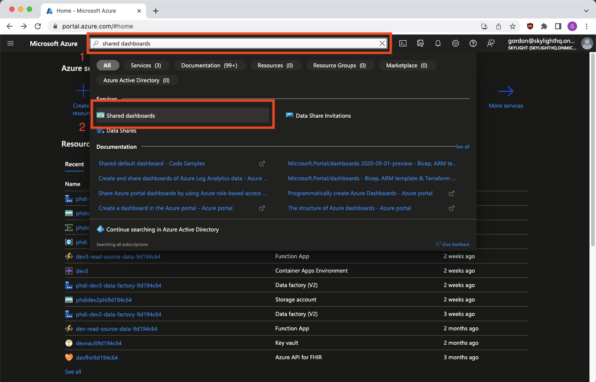
<figcaption align = "left">From the Azure homepage, search for "shared dashboards" in the search bar. Click the corresponding option in the dropdown.
</figcaption>

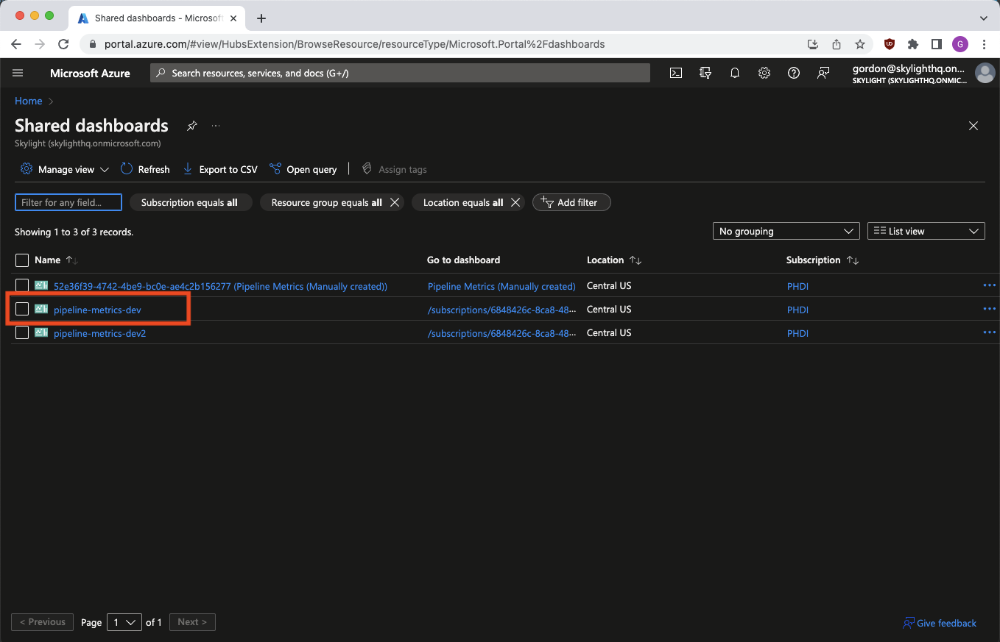
<figcaption align = "left">Select your resource group from the list.
</figcaption>

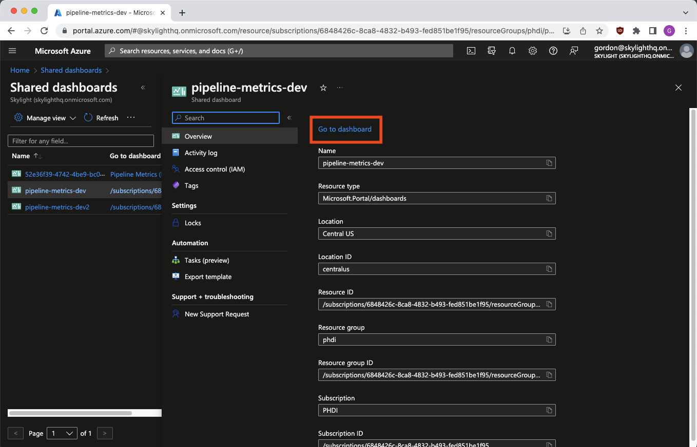
<figcaption align = "center">Click the small blue "Go to dashboard" link.
</figcaption>

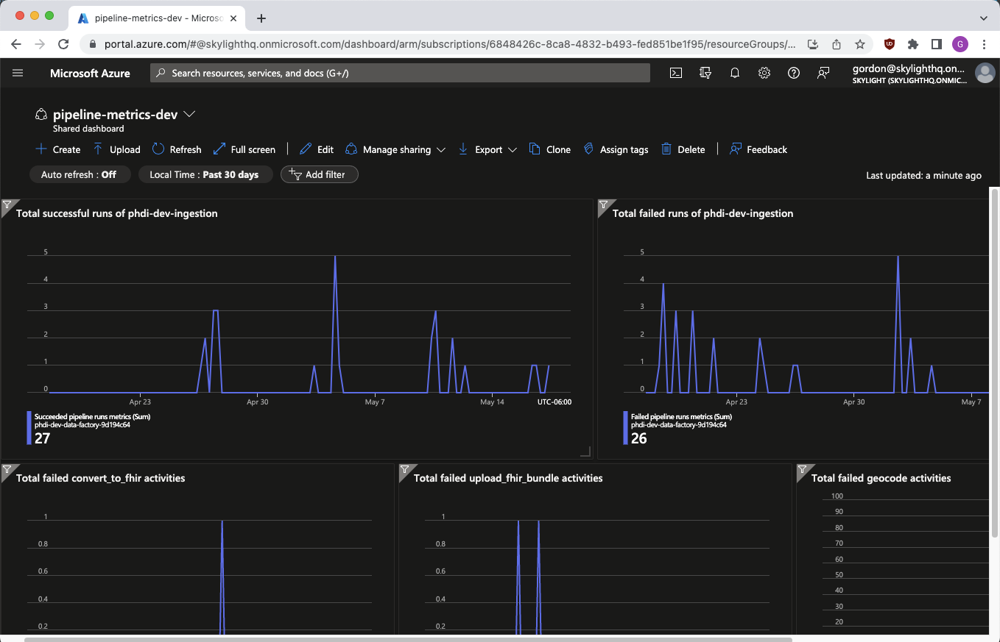

Here we have several graphs showing whole pipeline passes, whole pipeline fails, and three graphs showing failures of
specific steps (Convert to FHIR, Upload FHIR bundle, and Geocode). Using the filters above the graphs we can adjust date
ranges to observe failure trends over time. This is useful for pinpointing a date when a bug was introduced etc. More info
on creating and editing dashboards can be found [here](https://learn.microsoft.com/en-us/azure/azure-portal/azure-portal-dashboards).