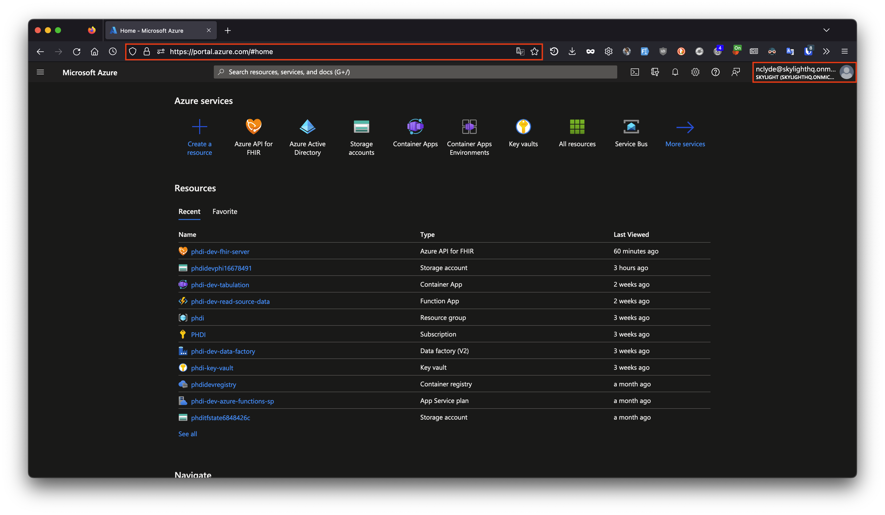
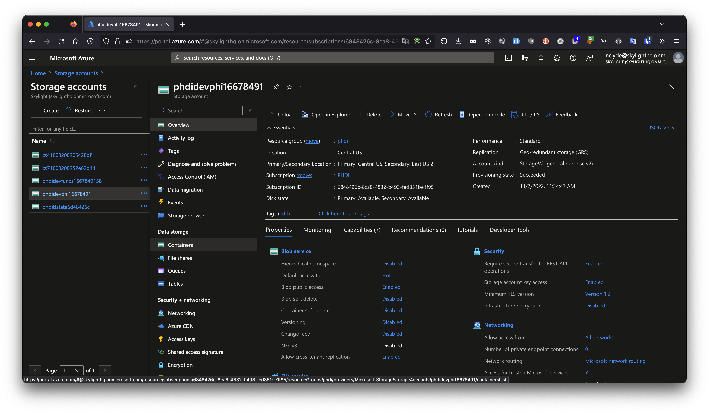
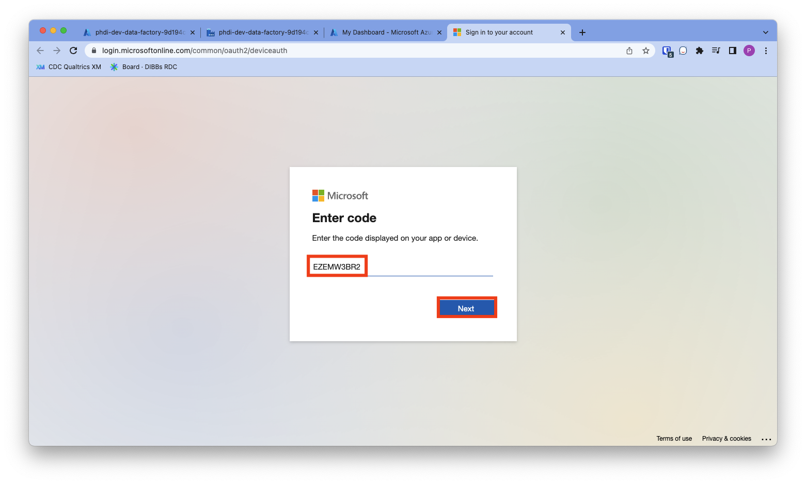

# Execution Guide: How to run data through the Azure Starter Kit

### Run an Hl7v2 vaccination message through the pipeline 

Now that the starter kit has been deployed, we can run some data through it! The `sample-data/` directory in your forked version of the repository contains some dummy VXU messages that can be used to test the success and failure modes of the ingestion pipeline. To start, let's use `VXU_single_messy_demo.hl7` file that has a single VXU message. The PID segment of this message (shown below) contains some dirty data:
1. The patient's name is mixed case and contains a numeric character.
2. The patient's phone number is not in a standard format.
3. The patient's address is non-standard and has not been geocoded.

```diff
PID|1|7777555^4^M11^test^MR^University Hospital^19241011^19241012|PATID7755^5^M11^test1|PATID7758^^^test5|
- doe .^ John1 ^A.
|TEST^Mother, of^L|198505101126+0215|M||2106-3^White^HL70005|
- 555 E. 3065 S.^^Salt Lake CIty^ut^84106^USA
||
- 801-540-3661^^CP
|||M^Married||4880776||||N^NOT HISPANIC OR LATINO^HL70189||N||US^United States of America^ISO3166_1||||N|||20080110015014+0315|||||||
```

If you would like, feel free to confirm that this is the case by inspecting the file directly in the text editor of your choice. To run this message through the ingestion pipeline follow the steps below.

1. Open [https://portal.azure.com/](https://portal.azure.com/) in your browser.
1. Ensure that you are using the account that has access to the Azure resource group we have used so far.
1. Search for and select `Storage accounts` to view all storage accounts we have deployed.
1. Select the PHI storage account, which is where all Protect Health Information is stored outside of the FHIR server. The precise name of the storage bucket will have the form `phdi{environment}phi{clientId}`, e.g., `phdidevphi1667849158`.
1. View containers by clicking `Containers` in the sidebar on the left. 
1. Select the `source-data` container, then the `vxu` folder. 
1. Upload the `VXU_single_messy_demo.hl7` file from the `sample-data/` directory of your forked version of the repository to the `source-data/vxu/` directory of your PHI bucket. This can be done easily by first clicking the `Upload` button and then clicking the blue button with a folder icon in the top left and choosing the file. Once the file is chosen, click the blue `Upload` button at the bottom of the left sidebar to finish the upload. Note that because the ingestion pipeline is event-driven, simply uploading the file is all that is required to trigger the pipeline. There is an event listener monitoring the PHI bucket for file creation events.
1. To see that the pipeline has executed, search for `Data factories` and go to the Data factories page.
1. Select your data factory, which will be titled `phdi-{environment}-data-factory`.
1. Launch the Data Factory Studio by clicking the blue button that says `Launch studio`.
1. Select your ingestion pipeline, which will be titled `phdi-{environment}-ingestion`.
1. You should now see a diagram showing the steps of the pipeline. To view the status of our attempted run, click `Monitor` on the left sidebar.
1. We should now see that the ingestion pipeline has processed one message successfully.
1. To view the JSON configuration for the pipeline and a visualization of the process, go to the `AUTHOR` tab.
1. To view the cleaned and enriched data in the FHIR server, visit https://shell.azure.com to open the Cloud Shell.
1. Type the command `az login` and press enter. Copy the code provided, click the link, and paste the code. Then follow the prompts to complete login.
1. To search for a patient named John Doe, enter the following commands, replacing `dev` with whichever environment you are currently searching in:
```bash
token=$(az account get-access-token --resource=https://phdi-dev-fhir-server.azurehealthcareapis.com --query accessToken --output tsv)
RESPONSE=$(curl -X GET --header "Authorization: Bearer $token" https://phdi-dev-fhir-server.azurehealthcareapis.com/Patient?family=DOE&given=JOHN)
echo $RESPONSE | jq
```


The table below describes the contents and expected ingestion pipeline behavior for each of the other files included in `sample-data/`. Feel free to try them out for yourself! 

| Test File | File Contents | Expected Outcome |
| --------- | --------------| ---------------- |
|VXU-V04-01_success_single.hl7| A single valid VXU message.|The ingestion pipeline will process a single message and upload it to the FHIR server.|
|VXU-V04-02_failedConversion.hl7| A single invalid VXU message that cannot be converted to FHIR.| The ingestion process will fail during the initial conversion to FHIR step. Information about the failure is written to `failed_fhir_conversion\vxu\`.
|VXU-V04-02_failedUpload.hl7| A single VXU message that converts to an invalid FHIR bundle.| The ingestion pipeline will fail during the final step when it attempts to upload the data to the FHIR server. Information about the failure is written to `failed_fhir_uploads\vxu\`.|
|VXU-V04-02_success_batch.hl7| A batch Hl7 message containing two valid VXU messages.| The ingestion pipeline is triggered twice and runs successfully to completion both times.|
|VXU-V04-03_batch_1_success_1_failConversion.hl7| A batch Hl7 message containing one valid and one invalid VXU message.| The ingestion pipeline will run twice. On one execution it successfully processes the data and uploads to the FHIR server. On the other execution it fails.|
