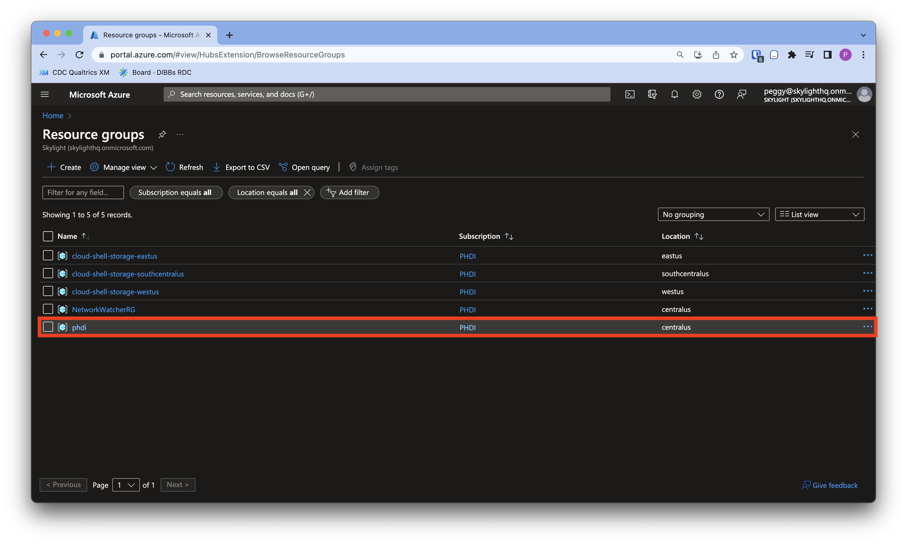
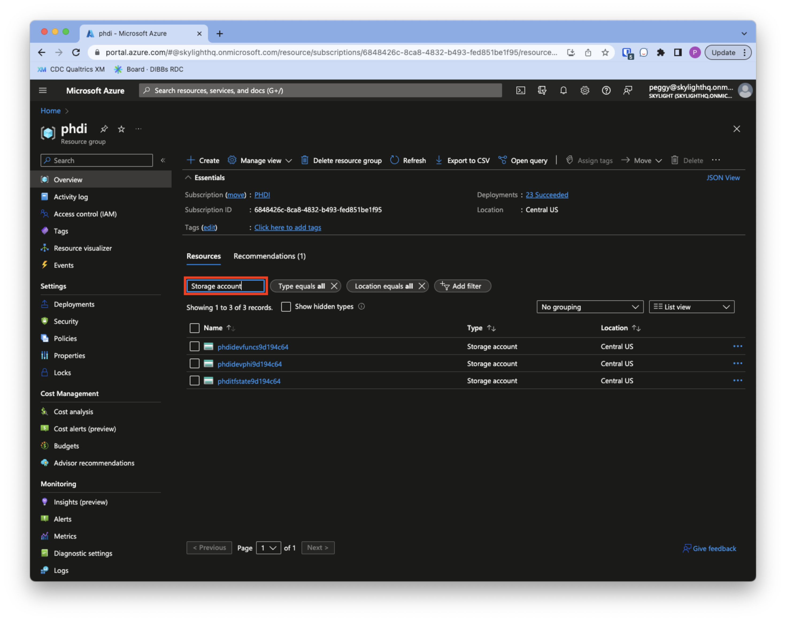
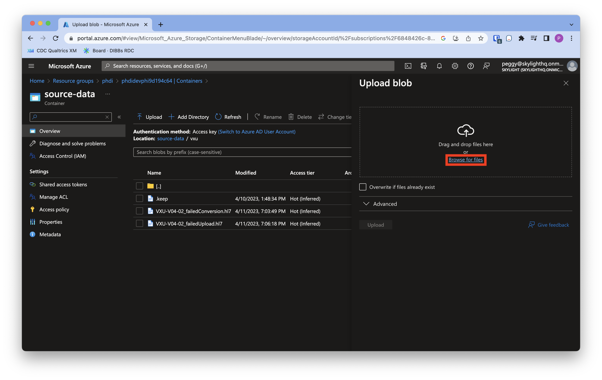
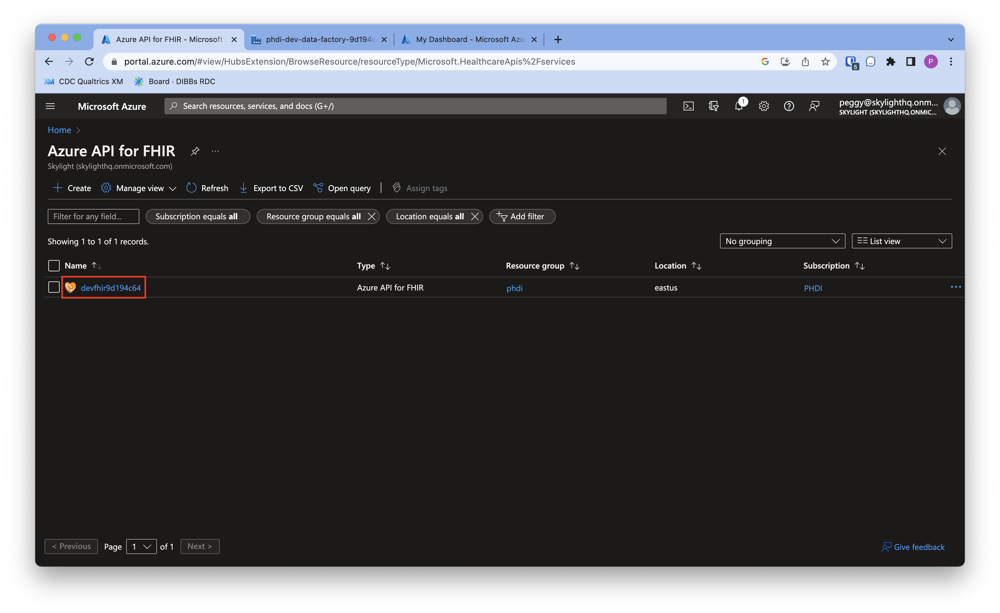
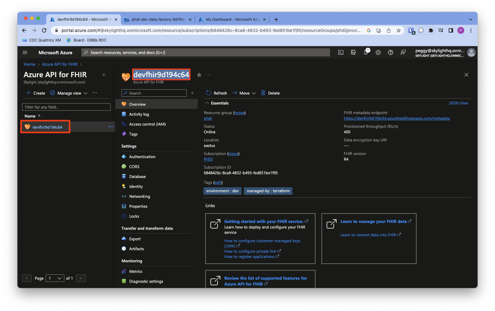
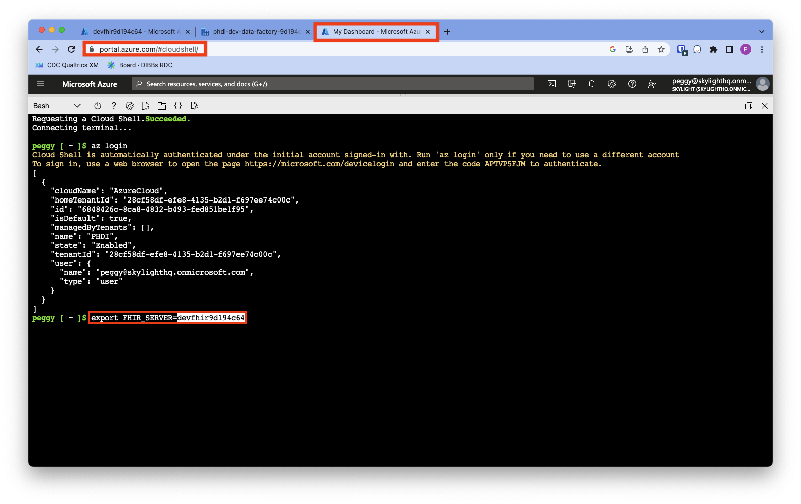

# Execution Guide: How to run data through the Azure Starter Kit

## Set Up: User requirements
First, please confirm that you meet the following user requirements:
1. Access to an Azure resource group where the starter kit has been deployed and the following roles:
    - `Storage Blob Data Contributor` on the PHI storage account
    - `FHIR Data Contributor` on the FHIR server
2. All of the files in the [sample-data/](../sample-data/) directory have been downloaded to your computer.
    - They can be downloaded as a zip file from [this link](https://github.com/CDCgov/phdi-azure/archive/refs/heads/main.zip).


If your organization has not yet implemented the pipeline, please follow the steps in this [Implementation Guide](https://github.com/CDCgov/phdi-azure/blob/main/docs/implementation-guide.md). 

If you do not have sufficient access, please contact your organization's Azure administrator.


## How to Use: Run a successful Hl7v2 vaccination message through the pipeline

<b>This how to guide is divided into 4 parts:</b>
1. Accessing your Azure account 
2. Uploading and running data through the pipline
3. Monitoring pipeline activities in Azure Data Factory
4. Viewing cleaned and enriched data in the FHIR server

<details>
    <summary><h4>View sample Hl7v2 vaccination message with dirty data</h4></summary>
    
The `sample-data/` directory contains dummy unsoliciated vaccination record update (VXU) messages that can be used to test the success and failure modes of the ingestion pipeline. To start, let's use `VXU_single_messy_demo.hl7` file that has a single VXU message. The Patient Identifier Segment (PID) of this message (shown below) contains some dirty data:
1. The patient's name is mixed case and contains a numeric character.
2. The patient's phone number is not in a standard format.
3. The patient's address is non-standard and has not been geocoded.

```diff
PID|1|7777555^4^M11^test^MR^University Hospital^19241011^19241012|PATID7755^5^M11^test1|PATID7758^^^test5|
- doe .^ John1 ^A.
|TEST^Mother, of^L|198505101126+0215|M||2106-3^White^HL70005|
- 555 E. 3065 S.^^Salt Lake CIty^ut^84106^USA
||
- 801-540-3661^^CP
|||M^Married||4880776||||N^NOT HISPANIC OR LATINO^HL70189||N||US^United States of America^ISO3166_1||||N|||20080110015014+0315|||||||
```

If you would like, feel free to confirm that this is the case by inspecting the file directly in the text editor of your choice.
</details>

<details>
    <summary><h4>Part 1: Access your Azure Portal account</h4></summary>
    
1. Open [https://portal.azure.com/](https://portal.azure.com/) in your browser and log in with your username and password.
1. Go to the search bar in the header and search for `Resource groups`. Click on `Resource groups` in the search dropdown. 
1. Click into the appropriate Azure resource group. 
</details>   

<details>
    <summary><h4>Part 2: Upload and run data through the pipeline</h4></summary>

> **Note**: If you prefer, you can upload data using the [Azure Storage Explorer Tool](https://azure.microsoft.com/en-us/products/storage/storage-explorer/). We don't provide instructions for using that tool here, but the broad strokes will be the same - you'll need to upload `sample-data/VXU-V04-01_success_single.hl7` to the `source-data` container in your PHI storage account.
    
1. Within your `Resource group`, filter down to view only `Storage account` type resources. To do so, click into the `Filter for any field...` search bar and type in `Storage account`.
1. Click into the `PHI` storage account, which is where all Protected Health Information is stored outside of the FHIR server. The precise name of the storage bucket will have the form `phdi{environment}phi{clientId}`, e.g., `phdidevphi1667849158`.
1. Go to the left sidebar and under the `Data storage` header, click `Containers`. 
1. Click into the `source-data` container.
1. Then click into the `vxu` folder.
1. Now we're ready to run a VXU message through the pipeline! Click the `Upload` button in the toolbar.
1. Then click `Browse for files`.     
1. Navigate to the folder on your computer where you've downloaded or forked the `sample-data/` folder and select the `VXU-V04-01_success_single.hl7` file. Click `Open`, then click `Upload` to upload this file into the `source-data/vxu/` directory of your PHI bucket.    

     > **Note**: because the ingestion pipeline is event-driven, simply uploading the file is all that is required to trigger the pipeline. There is an event listener monitoring the PHI bucket for file creation events.
</details>
    
<details>
    <summary><h4>Part 3: View pipeline run in Azure Data Factory</h4></summary>

Congrats! You've run a VXU message through the pipeline. Now you can view the pipeline run to confirm that it ran successfully without errors.
1. To check that the pipeline has executed, go to the search bar in the header, and search for `Data factories`. Select the `Data factories` option in the search dropdown.
1. Click into your data factory, which will have the form `phdi-{environment}-data-factory-{client-id}`.
1. Launch the Data Factory Studio by clicking the blue button that says `Launch studio`
1. In the left sidebar, click on the the `Monitor` tab (radar icon) to view the pipeline runs.
1. Click into your pipeline run, which will have the form `phdi-{environment}-ingestion`. If you see multiple pipline runs with this name, select the pipeline with the most recent run start time.

     > **Note**: this pipeline may still have an `In progress` status. You can click the 'refresh' button to view the pipeline run in its most updated status.
 

1. After clicking into your pipeline run, you should see a diagram showing the steps of the pipeline and a table with information about each activity. We should now see by the green checkmarks and `succeeded` statuses next to each activity that the ingestion pipeline has processed one message successfully.

     > **Note**: You can click the 'refresh' button to view the pipeline run activities in their most recent status. 
</details>
    
<details>
    <summary><h4>Part 4: View cleaned and enriched data in the FHIR server using Cloud Shell</h4></summary>

1. Open another tab and go to [https://shell.azure.com](https://shell.azure.com).
     > **Instructions for first time users**: 
     
     > A pop up will appear asking you to select either the Bash or PowerShell option. Select the `Bash` option. 
     
     > A second pop up will appear stating "You have no storage mounted". Click `Create storage`.
1. Confirm that you're in Bash mode by checking that the dropdown in the top left under the `Microsoft Azure` header has `Bash` selected.
1. Then in the terminal, type the command `az login` and press enter on your keyboard.
1. Copy the authentication code provided.
1. Click the device login link, and paste in the authentication code.
1. Follow the prompts to complete login. After logging in, you should see a pop up that says "You have signed in...".
1. Return to the tab with Azure Cloud Shell open.

Now that we're authenticated, we're going to try to search for a patient named "John Doe" in the VXU message we ran earlier. 
1. A couple of the commands below will require you to update the URL in the command with the name of your FHIR server. To get the name of your FHIR server, go back to the tab with [portal.azure.com](portal.azure.com) open. Then in the search bar, type in `Azure API for FHIR` and select this option in the search dropdown.
1. You should see your FHIR server which will have the following form: `{environment}fhir{client-id}`. Click into your FHIR server.
1. Copy the name of your FHIR server which will have the following form: (`{environment}fhir{client-id}`).
1. Go back to the tab with Cloud Shell open. Copy and paste the command below, then replace the **FHIR_SERVER_NAME** text with the pasted name of your FHIR server. This will save the name of your FHIR server into a variable that will be referenced in later commands. <pre>export FHIR_SERVER=<b>FHIR_SERVER_NAME</b></pre>
1. Copy and paste the below command into the terminal and hit enter. This gets you a bearer token that will be used to authenticate in the next command:<pre>
token=$(az account get-access-token --resource=https://$FHIR_SERVER.azurehealthcareapis.com --query accessToken --output tsv)</pre>
1. Copy and paste the below command into the terminal and hit enter. This uses the bearer token from above to authenticate and search for the "John Doe" user: <pre>RESPONSE=$(curl -X GET --header "Authorization: Bearer $token" "https://$FHIR_SERVER.azurehealthcareapis.com/Patient?family=DOE&given=JOHN")</pre>
1. Finally, copy and paste the below command into the terminal and hit enter. This pretty-prints the JSON response showing that John Doe was found in the VXU message. After you're done reviewing the response, press `q` on your keyboard to exit out of the jq tool and return to the terminal. <pre>echo $RESPONSE | jq | less</pre> 

</details>    

## Additional Examples: Run single and batch VXU messages with expected errors and troubleshoot

<details>
    <summary><h4>Table containing expected outcomes of each sample VXU message</h4></summary>
    
The table below describes the contents and expected ingestion pipeline behavior for each of the other files included in `sample-data/`. Choose another message to run through the pipeline to see what a pipeline run with an expected error or a batch message will look like. 

| Test File | File Contents | Expected Outcome |
| --------- | --------------| ---------------- |
|VXU-V04-01_success_single.hl7| A single valid VXU message.|The ingestion pipeline will process a single message and upload it to the FHIR server.|
|VXU-V04-02_failedConversion.hl7| A single invalid VXU message that cannot be converted to FHIR.| The ingestion process will fail during the initial conversion to FHIR step. Information about the failure is written to `failed_fhir_conversion\vxu\`.
|VXU-V04-02_failedUpload.hl7| A single VXU message that converts to an invalid FHIR bundle.| The ingestion pipeline will fail during the final step when it attempts to upload the data to the FHIR server. Information about the failure is written to `failed_fhir_uploads\vxu\`.|
|VXU-V04-02_success_batch.hl7| A batch Hl7 message containing two valid VXU messages.| The ingestion pipeline is triggered twice and runs successfully to completion both times.|
|VXU-V04-03_batch_1_success_1_failConversion.hl7| A batch Hl7 message containing one valid and one invalid VXU message.| The ingestion pipeline will run twice. On one execution it successfully processes the data and uploads to the FHIR server. On the other execution it fails.|
</details>
    
If the pipeline run has an error, then follow the troubleshooting steps in the section below.
<details>
    <summary><h4>Troubleshooting steps to view pipeline failures in Azure Data Factory</h4></summary>

When a pipeline run ends in failure, Azure Data Factory makes it easy to see the error that caused the failure.

1. On the `Monitor` tab in Azure Data Factory Studio (the page we opened in step 4 of the ["Viewing the pipeline run" section](#viewing-the-pipeline-run)), select the pipeline run that failed.

1. In this view, click the button next to "Failed" on any steps that failed in the "Activity Runs" section to view the relevant error.

1. The error message should provide the information you need to resolve the issue before reuploading the data for another pipeline run.

</details>
