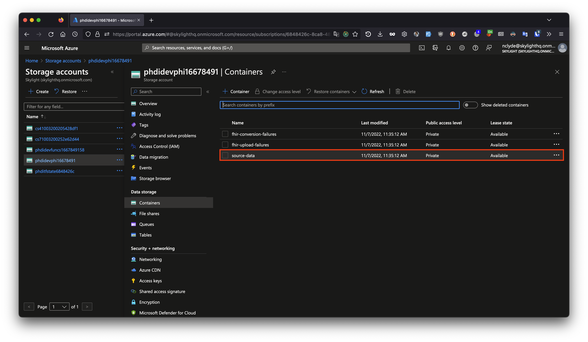

# Execution Guide: How to run data through the Azure Starter Kit

### Set up accounts prior to running data though the pipeline
First, please confirm that you meet the following user requirements:
1. Access to an Azure resource group where the starter kit has been deployed. Access must include the following roles:
    - `Storage Blob Data Contributor` on the PHI storage account
    - `FHIR Data Contributor` on the FHIR server
2. All of the files in the [sample-data/](../sample-data/) directory have been downloaded to your computer.

If you have not implemented the pipeline or do not meet one of the user requirements above, please follow the steps in this [Implementation Guide](https://github.com/CDCgov/phdi-azure/blob/main/docs/implementation-guide.md). 


### Run an Hl7v2 vaccination message through the pipeline 

Now that the starter kit has been deployed, we can run some data through it! The `sample-data/` directory in your forked version of the repository contains some dummy VXU messages that can be used to test the success and failure modes of the ingestion pipeline. To start, let's use `VXU_single_messy_demo.hl7` file that has a single VXU message. The PID segment of this message (shown below) contains some dirty data:
1. The patient's name is mixed case and contains a numeric character.
2. The patient's phone number is not in a standard format.
3. The patient's address is non-standard and has not been geocoded.

```diff
PID|1|7777555^4^M11^test^MR^University Hospital^19241011^19241012|PATID7755^5^M11^test1|PATID7758^^^test5|
- doe .^ John1 ^A.
|TEST^Mother, of^L|198505101126+0215|M||2106-3^White^HL70005|
- 555 E. 3065 S.^^Salt Lake CIty^ut^84106^USA
||
- 801-540-3661^^CP
|||M^Married||4880776||||N^NOT HISPANIC OR LATINO^HL70189||N||US^United States of America^ISO3166_1||||N|||20080110015014+0315|||||||
```

If you would like, feel free to confirm that this is the case by inspecting the file directly in the text editor of your choice. To run this message through the ingestion pipeline follow the steps below.

1. Open [https://portal.azure.com/](https://portal.azure.com/) in your browser.
2. If you're not already logged in, log into Azure with your username and password and follow the steps for multifactor authentication (MFA). 
3. Make sure you're logged into the account that has access to the Azure resource group we have used so far. To check, click on 'Resource groups' under the "Azure services" heading and look for the name of the appropriate Azure resource group
4. Then, click on the search bar and search for `Storage accounts`. Select the 'Storage accounts' option in the search dropdown to view all storage accounts we have deployed.
5. Click on the name of the PHI storage account, which is where all Protected Health Information is stored outside of the FHIR server. The precise name of the storage bucket will have the form `phdi{environment}phi{clientId}`, e.g., `phdidevphi1667849158`.
6. After you've clicked into the storage bucket, click 'Containers' under the 'Data storage' header on the left sidebar. 
7. In the list of containers, click on the `source-data` container. Then click into the `vxu` folder. 
8. Now we're ready to run a VXU message through the pipeline! First, click the 'Upload' button in the toolbar which should open up a sidebar to the right.
9. Within the Upload sidebar, click 'Browse for files' and navigate to the `sample-data/` folder on your computer where you've downloaded or forked the `sample-data/` from this GitHub repository. Select the `VXU-V04-01_success_single.hl7` file to upload this file into the `source-data/vxu/` directory of your PHI bucket. (Note: because the ingestion pipeline is event-driven, simply uploading the file is all that is required to trigger the pipeline. There is an event listener monitoring the PHI bucket for file creation events.)
10. Congrats! You've executed a VXU message through the pipeline. To check that the pipeline has executed, go to the search bar, and search for `Data factories`. Click on the 'Data factories' option in the search dropdown.
11. Select your data factory, which will be titled `phdi-{environment}-data-factory`. If you see multiple data factories with the same name, choose the first one in the list. If you do not see any data factories, skip to step 13.
12. Launch the Data Factory Studio by clicking the blue button that says `Launch studio`.
13. Click on the 'Monitor' tab in the left sidebar (radar icon) to view the 'Pipeline runs'.
15. Select your ingestion pipeline, which will be titled `phdi-{environment}-ingestion`. If you see multiple piplines with this name, select the one at the top (aka the most recently run pipeline).
16. After clicking into your ingestion pipeline, you should see a diagram showing the steps of the pipeline.
17. We should now see that the ingestion pipeline has processed one message successfully.
19. Now we can view the cleaned and enriched data in the FHIR server using Cloud Shell. To do so, open another window/tab and go to https://shell.azure.com. 
20. If this is your first time accessing Azure Cloud Shell, a pop up will appear asking you to select either the Bash or PowerShell option. Select the Bash option. 
21. If this is NOT your first time accessing Azure Cloud Shell, confirm that you're in Bash mode by checking that the dropdown in the top left under the "Microsoft Azure" header has "Bash" selected.
22. Then in the terminal, type the command `az login` and press enter. Copy the code provided, click the link, and paste the code. Then follow the prompts to complete login.
23. Now you'll need to update the URL in the code with the URL of your FHIR server. To get the URL of your FHIR server, first go back to portal.azure.com in another tab. Then in the search bar, type in "Azure API for FHIR" and select this option in the search dropdown.
24. On the Azure API for FHIR page, click into your FHIR server API which should open a right sidebar. Within this sidebar, go to the FHIR metadata endpoint text under "Essentials" and select the URL prior to the "/metadata" portion so you that have a URL copied that looks something like: "https://devfhir9d194c64.azurehealthcareapis.com".

25. To search for a patient named John Doe, go back to the tab with Cloud Shell open. Type this command into the terminal:```bash
token=$(az account get-access-token --resource=https://phdi-dev-fhir-server.azurehealthcareapis.com --query accessToken --output tsv)```.
Replace the URL after ```--resource=``` with the URL you copied above. Hit enter to run this command.

26. Then, type in this command: ```RESPONSE=$(curl -X GET --header "Authorization: Bearer $token" https://phdi-dev-fhir-server.azurehealthcareapis.com/Patient?family=DOE&given=JOHN)```
Replace the URL in-between ```Bearer $token``` and ```/Patient``` with the URL you copied above. Hit enter to run this command.


27. Finally, press the up arrow until you see this command: ```echo $RESPONSE | jq``` Hit enter to run this command.


28. The table below describes the contents and expected ingestion pipeline behavior for each of the other files included in `sample-data/`. Feel free to try them out for yourself by repeating steps 6-14 above! 

| Test File | File Contents | Expected Outcome |
| --------- | --------------| ---------------- |
|VXU-V04-01_success_single.hl7| A single valid VXU message.|The ingestion pipeline will process a single message and upload it to the FHIR server.|
|VXU-V04-02_failedConversion.hl7| A single invalid VXU message that cannot be converted to FHIR.| The ingestion process will fail during the initial conversion to FHIR step. Information about the failure is written to `failed_fhir_conversion\vxu\`.
|VXU-V04-02_failedUpload.hl7| A single VXU message that converts to an invalid FHIR bundle.| The ingestion pipeline will fail during the final step when it attempts to upload the data to the FHIR server. Information about the failure is written to `failed_fhir_uploads\vxu\`.|
|VXU-V04-02_success_batch.hl7| A batch Hl7 message containing two valid VXU messages.| The ingestion pipeline is triggered twice and runs successfully to completion both times.|
|VXU-V04-03_batch_1_success_1_failConversion.hl7| A batch Hl7 message containing one valid and one invalid VXU message.| The ingestion pipeline will run twice. On one execution it successfully processes the data and uploads to the FHIR server. On the other execution it fails.|
