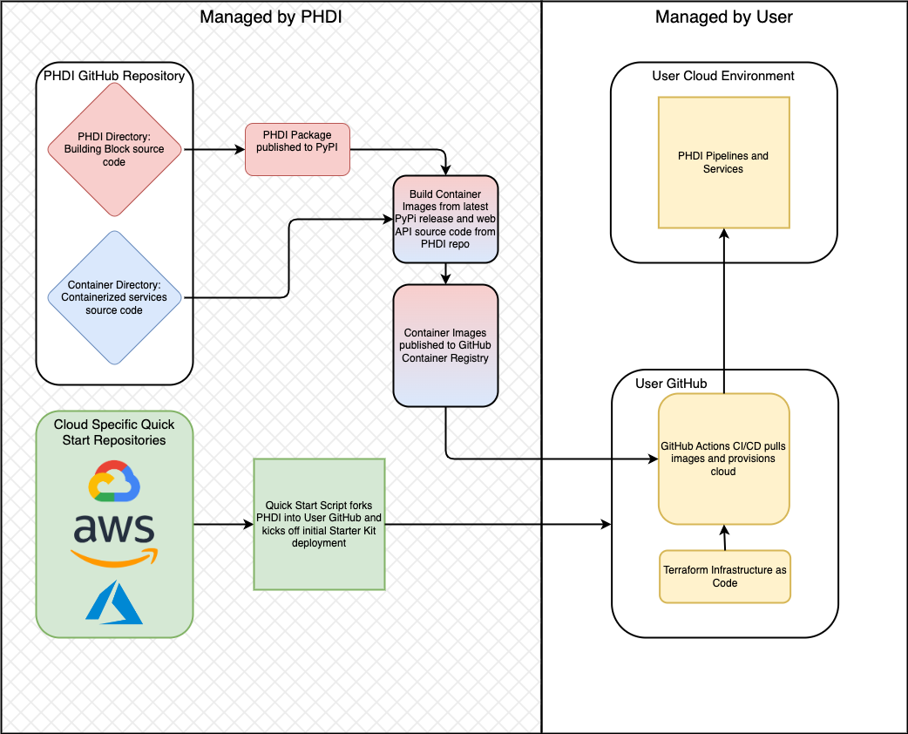

# Getting Started

This is a guide for getting started as a user and/or developer with the PHDI Azure Starter Kit pipeline. You'll find resources on how to set up a local development environment, how these tools are deployed, and more.

- [Getting Started](#getting-started)
  - [Architecture](#architecture)
    - [Azure Blob Storage: Storage](#azure-blob-storage-storage)
        - [PHI (Protected Health Information) Storage Account](#phi-protected-health-information-storage-account)
        - [Azure Functions Storage Account](#azure-functions-storage-account)
        - [Terraform State Storage Account](#terraform-state-storage-account)
    - [Azure Data Factory (ADF): Orchestration](#azure-data-factory-adf-orchestration)
    - [Azure Functions: Cloud-native Event-driven Processing](#azure-functions-cloud-native-event-driven-processing)
  - [Infrastructure as Code (IaC)](#infrastructure-as-code-iac)
    - [Running Terraform Locally](#running-terraform-locally)
  - [Continuous Integration and Continuous Deployment (CI/CD)](#continuous-integration-and-continuous-deployment-cicd)
    - [Continuous Integration (CI)](#continuous-integration-ci)
    - [Continuous Deployment (CD)](#continuous-deployment-cd)

## Architecture

### PHDI Overview

The PHDI code base is split between the core [phdi](https://github.com/CDCgov/phdi) repository and cloud provider-specific Starter Kit repositories. This repository is the Starter Kit for Azure. In general, `phdi` contains two components: the source code for the PHDI Python package, and the source code for the PHDI containerized services. The Python package is published to [PyPi](https://pypi.org/project/phdi/) and contains the core functionality of our Building Blocks (e.g., the logic for how patient names are standardized). The container images are built using the latest version of the PHDI Python package available on PyPi and pushed to the [container registry](https://github.com/orgs/CDCgov/packages?repo_name=phdi) associated with the `phdi` repository. These containers are simple REST API services that expose functionality from the Python package on different endpoints. 

Both the Python package and the containerized services can be used on their own in any manner users would like. However, the Starter Kit repositories combine the containerized services with an orchestration layer (Azure Data Factory in this repository), CI/CD pipelines, and Infrastructure as Code to provide a "batteries included" cloud-based system for ingesting, standardizing, and enriching public health data. As documented in the [Implementation Guide](./implementation-guide.md), the [Quick Start Script](../quick-start.sh) automates the process of forking a Starter Kit repository into a repository owned by the user or their organization and deploying the entire pipeline to their own cloud environment. This high-level architecture of the PHDI project is shown below.



### Azure Starter Kit
Source data is stored in Azure using [Azure Blob Storage](https://learn.microsoft.com/en-us/azure/storage/blobs/). When new data is written to this blob store, the `read-source-data` [Azure Function](https://learn.microsoft.com/en-us/azure/data-factory/control-flow-azure-function-activity) is triggered. This function simply reads the new data from blob storage and passes it, along with some metadata, to the Starter Kit pipeline for further processing. The pipeline is implemented in [Azure Data Factory (ADF)](https://learn.microsoft.com/en-us/azure/data-factory/) and is responsible for data cleaning, standardization, enrichment, record linkage, and finally uploading data to a FHIR server ([Azure API for FHIR](https://learn.microsoft.com/en-us/azure/healthcare-apis/azure-api-for-fhir/overview)). Each step of the pipeline, orchestrated by ADF, is simply a REST API call to independent containerized microservices (aka Building Blocks) developed by PHDI ([available here](https://github.com/orgs/CDCgov/packages?repo_name=phdi)). These services are deployed in Azure as [Azure Container Apps (ACA)](https://learn.microsoft.com/en-us/azure/container-apps/). Each endpoint on a service performs a single function or step in a pipeline (e.g., patient name standardization), and returns the processed data back to the data factory. It is then passed on to the next service. Endpoints that perform related functions (e.g., name standardization and phone number standardization) are provided by a single service. Ingested data may be accessed via the FHIR server's API ([HL7 docs](https://hl7.org/fhir/http.html), [Azure docs](https://learn.microsoft.com/en-us/azure/healthcare-apis/azure-api-for-fhir/overview-of-search)), or the tabulation service. When called, the tabulation service will extract data, in tabular form according to a user-defined schema, from the FHIR server and written to flat files. This entire architecture is shown in the diagram below.


### Azure Blob Storage: Storage

All data for the Starter Kit in Azure is stored in [Azure Storage Accounts](https://learn.microsoft.com/en-us/azure/storage/common/storage-account-overview), primarily in [Azure Blob Storage Containers](https://learn.microsoft.com/en-us/azure/storage/blobs/). Currently the Starter Kit includes the three storage accounts described below.

#### PHI (Protected Health Information) Storage Account

The PHI storage account is the primary storage account of the Starter Kit. All PHI/PII data stored outside of the FHIR server is stored in this account. The account has the following three containers:
1. `source-data`
2. `fhir-conversion-failures`
3. `fhir-upload-failures`

Data in the form it is originally received by the Starter Kit is stored in the `source-data`. In practice, the pipeline has three failure modes. On occasion, issues will be encountered validating and converting source data to FHIR at the beginning of the ingestion pipeline and uploading data to the FHIR server at the end of the ingestion pipeline. In the event of FHIR conversion and upload failures, the data that could not be converted or uploaded is written to the appropriate container (`fhir-conversion-failures` or `fhir-upload-failures`) as a JSON blob along with a log describing the specific failure. Additionally, each of these three containers contains a subdirectory for each type of public health data the Starter Kit can process. A new ELR message for the pipeline to ingest would be written to `source-data/elr/`, while an eCR message that failed to be uploaded to the FHIR server would be written to `fhir-upload-failures/ecr`. The overall directory structure for the PHI storage account is shown below.

```bash
phdi{ENV NAME}phi{UNIX TIME OF CREATION}/
└── source-data/
    ├── elr/
    ├── ecr/
    └── vxu/
└── fhir-conversion-failures/
    ├── elr/
    ├── ecr/
    └── vxu/
└── fhir-upload-failures/
    ├── elr/
    ├── ecr/
    └── vxu/
```

#### Azure Functions Storage Account
The second storage account in the Starter Kit is the Azure Functions Storage Account. This account is used for all storage needs related to Azure Functions. The Starter Kit currently creates a container in this account to store the source code for the [`read-source-data](#azure-functions) function.

#### Terraform State Storage Account
The third and final storage account in the Starter Kit is the Terraform State Storage Account. This account is shared across all deployed environments of the Starter Kit (dev, prod, QA, etc.) and is used to store the Terraform state of each environment. For more information on Terraform state, please refer to the [Infrastructure as Code (IaC)](#infrastructure-as-code-iac) section of this doc.

### Azure Data Factory (ADF): Orchestration
We use [Azure Data Factory (ADF)](https://learn.microsoft.com/en-us/azure/data-factory/control-flow-azure-function-activity) to define processes that require the use of multiple Building Blocks. These data flows can be developed using [The Azure Function Activity UI](https://learn.microsoft.com/en-us/azure/data-factory/control-flow-azure-function-activity#create-an-azure-function-activity-with-ui). However for best Infrastructure as Code (IaC) practices, we recommend deploying ADF pipelines in production from JSON configuration files. This allows consistency and reproducibility between deployments and the use of source control to track changes to the pipeline over time. The JSON configuration file for the Starter Kit ingestion pipeline is available in [`/terraform/modules/data_factory/ingestion-pipeline.json`](../terraform/modules/data_factory/ingestion-pipeline.json) in this repository.

The table below summarizes the pipeline, its purposes, triggers, inputs, steps, and results:

| Name | Purpose | Trigger | Input | Steps | Result |
| ---- | ------- | ------- | ----- | ----- | ------ |
| ingestion-pipeline | Read source data (HL7v2 and CDA), convert to FHIR, standardize, and upload to a FHIR server | File creation in storage container via Eventarc trigger | New file name and its storage container | 1. convert-to-fhir<br>2.standardize-patient-names<br>3. standardize-patient-phone-numbers<br>4. geocode-patient-address<br>5. compute-patient-hash<br>6. upload-to-fhir-server | HL7v2 and CDA messages are read, converted to FHIR, standardized and enriched, and uploaded to a FHIR server as they arrive in Cloud Storage. In the event that the conversion or upload steps fail, the data is written to separate storage containers along with relevant logging. |

### Azure Functions: Cloud-native Event-driven Processing
[Azure Functions](https://learn.microsoft.com/en-us/azure/data-factory/control-flow-expression-language-functions) are Microsoft's version of serverless functions, similar to Lambda in Amazon Web Services (AWS) and Cloud Functions in GCP. Serverless functions provide a relatively simple way to run services with modest runtime duration, memory, and compute requirements in the cloud. They are considered serverless because the cloud provider, Azure in this case, abstracts away management of the underlying infrastructure from the user. The [serverless-functions/](../serverless-functions/) directory contains source code for each of our Azure Functions. We have chosen to develop the functions in Python because the [PHDI SDK](https://github.com/CDCgov/phdi-sdk) is written in Python and Azure has [strong support and documentation](https://learn.microsoft.com/en-us/azure/azure-functions/functions-reference-python?tabs=asgi%2Capplication-level) for developing Azure Functions with Python.

The table below summarizes these functions, their purposes, triggers, inputs, and outputs:

| Name | Language | Purpose | Trigger | Input | Output | Effect |
| ---- | -------- | ------- | ------- | ------| ------ | ------ |
| read-source-data | Python | Trigger the ingestion pipeline on blob creation events on the `source-data` container. | blob | Blob creation event | N/A | The ingestion pipeline is triggered every time new messages are written to the `source-data` container. In the case when a batch message is uploaded to `source-data`, the pipeline is triggered once for every individual message in the batch. |   

### Azure Container Apps (ACA): Containerized Microservices

[Azure Container Apps (ACA)](https://learn.microsoft.com/en-us/azure/container-apps/) are one of the many ways to deploy containerized applications on Azure. We have chosen to use ACA for the time being because it is the simplest option in Azure for running containers—it is fully-managed, serverless, and supports horizontal scaling. As the number of containerized services deployed by the Starter Kit increase, we will likely move towards [Azure Kubernetes Service (AKS)](https://learn.microsoft.com/en-us/azure/aks/), Azure's managed Kubernetes offering. The following containerized services are deployed via ACA:

| Service | Purpose | Documentation and Source Code |
| ------- | ------- | ----------------------------- |
| Fhir-converter | Convert Hl7v2 and C-CDA data to FHIR at the beginning of the ingestion pipeline. |  [https://github.com/CDCgov/phdi/tree/main/containers/fhir-converter](https://github.com/CDCgov/phdi/tree/main/containers/fhir-converter) |
| Ingestion | Provide endpoints for each step of the ingestion pipeline except conversion to FHIR. | [https://github.com/CDCgov/phdi/tree/main/containers/ingestion](https://github.com/CDCgov/phdi/tree/main/containers/ingestion) |
| Tabulation | Extract and tabularize data from the FHIR server according to user-defined schema. |  [https://github.com/CDCgov/phdi/tree/main/containers/tabulation](https://github.com/CDCgov/phdi/tree/main/containers/tabulation) |
| Validation | Validate healthcare messages. |  [https://github.com/CDCgov/phdi/tree/main/containers/validation](https://github.com/CDCgov/phdi/tree/main/containers/validation) |
| Message-parser | Extract desired fields from a given healthcare message. |  [https://github.com/CDCgov/phdi/tree/main/containers/message-parser](https://github.com/CDCgov/phdi/tree/main/containers/message-parser) |


## Infrastructure as Code (IaC)

IaC is the practice of writing machine-readable code for infrastructure configuration. It offers numerous benefits, including allowing infrastructure to be tracked in source control and the ability to easily create multiple identical instances of our infrastructure. For more general information about IaC, this [Wikipedia page](https://en.wikipedia.org/wiki/Infrastructure_as_code) may be a good starting place. In this repository, the `phdi-azure/terraform/` directory contains full coverage for all of our Azure infrastructure with HashiCorp [Terraform](https://www.terraform.io/). This directory has the following structure:

```bash
terraform/
├── implementation/
├── modules/
│   ├── data_factory/
│   ├── read_source_data/
│   └── shared/
└── setup/
    ├── main.tf
    └── variables.tf
```

The `modules/` directory contains configuration for each Azure resource required to run the pipeline. The `implementation/` directory establishes how resources from each module relate to each other so that Terraform can properly implement the entire architecture. Finally, the `setup/` directory contains configuration for the initial setup of Terraform in the resource group where the Starter Kit is deployed. For more information on using Terraform, please refer to the [Terraform Documentation](https://www.terraform.io/docs) and [Terraform Registry](https://registry.terraform.io/). 

### Running Terraform Locally

This repository was built to use Terraform in conjunction with GitHub Actions as described in the [Implementation Guide](https://github.com/CDCgov/phdi-azure/blob/main/docs/implementation-guide.md). While it is technically possible to run the Terraform code from your local machine, you'll need to configure your Azure environment and Terraform variables properly. We don't provide instructions for doing so here.

## Continuous Integration and Continuous Deployment (CI/CD)

For more details on the CI/CD processes available in this Starter Kit, see the [DevOps](https://github.com/CDCgov/phdi-azure/blob/main/docs/devops.md) page.
