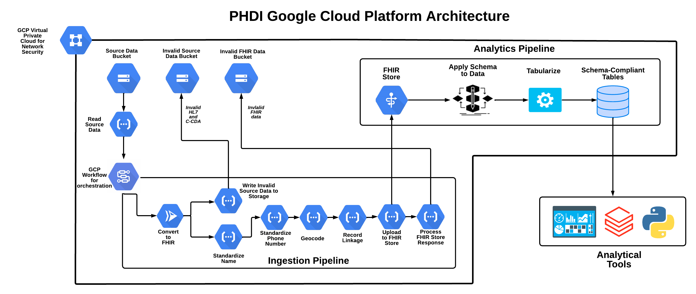

# Getting Started

This is a guide for getting started as a user and/or developer with the PRIME PHDI Google Cloud project. You'll find resources on how to setup a local development environment, how these tools are deployed, and more.

- [Getting Started](#getting-started)
  - [Architecture](#architecture)
    - [Google Workflows](#google-workflows)
    - [Cloud Functions](#cloud-functions)
    - [GCP Project Configuration](#gcp-project-configuration)
  - [Local Development Environment](#local-development-environment)
    - [Hardware](#hardware)
    - [Software](#software)
      - [Overview](#overview)
      - [Installation](#installation)
    - [Developing Python Google Cloud Functions](#developing-python-google-cloud-functions)
      - [Cloud Function Directory Structure](#cloud-function-directory-structure)
      - [Creating a Virtual Environment](#creating-a-virtual-environment)
      - [Cloud Function Dependencies](#cloud-function-dependencies)
      - [Development Dependencies](#development-dependencies)
      - [Running Cloud Functions Locally](#running-cloud-functions-locally)
      - [Cloud Function Unit Testing](#cloud-function-unit-testing)
      - [Pushing to Github](#pushing-to-github)
    - [Infrastructure as Code (IaC)](#infrastructure-as-code-iac)
      - [Running Terraform Locally](#running-terraform-locally)
    - [Continuous Integration and Continuous Deployment (CI/CD)](#continuous-integration-and-continuous-deployment-cicd)
      - [Continuous Integration (CI)](#continuous-integration-ci)
      - [Continuous Deployment (CD)](#continuous-deployment-cd)

## Architecture

We store data on Google Cloud Platform (GCP) in [Cloud Storage buckets](https://cloud.google.com/storage/docs). Data is processed in pipelines, defined as [Google Workflows](https://cloud.google.com/workflows/docs), that each orchestrate a series of calls to indepent microservices (AKA Building Blocks) that we have implemented using [Cloud Functions](https://cloud.google.com/functions/docs). Each service preforms a single step in a pipeline (e.g patient name standardization) and returns the processed data back to the workflow where it is passed on to the next service via a POST request. The diagram below describes the current version of our ingestion pipeline that converts source HL7v2 and CCDA data to FHIR, preforms some basic standardizations and enrichments, and finally uploads the data to a FHIR server.



### Google Workflows

Since PHDI Building Blocks are designed to be composable users may want to chain serveral together into pipelines. We use [Google Workflows](https://cloud.google.com/workflows/docs) to define processes that require the use of multiple Building Blocks. These workflows are defined using [YAML](https://yaml.org/) configuration files found in the [google-worklows/](https://github.com/CDCgov/phdi-google-cloud/tree/main/google-workflows) directory.

The table below summarizes these workflows, their purposes, triggers, inputs, steps, and results:

| Name | Purpose | Trigger | Input | Steps | Result |
| ---- | ------- | ------- | ----- | ----- | ------ |
| ingestion-pipeline | Read source data (HL7v2 and CCDA), convert to FHIR, standardize, and upload to a FHIR server | File creation in bucket via Eventarc trigger | New file name and its bucket | 1. convert-to-fhir<br>2.standardize-patient-names<br>3. standardize-patient-phone-numbers<br>4. geocode-patient-address<br>5. compute-patient-hash<br>6. upload-to-fhir-server | HL7v2 and CCDA messages are read, converted to FHIR, standardized and enriched, and uploaded to a FHIR server as they arrive in Cloud Storage. In the event that the conversion or upload steps fail the data is written to separate buckets along with relevent logging. |

### Cloud Functions
[Cloud Functions](https://cloud.google.com/functions/docs) are GCP's version of serverless functions, similar to Lamabda in Amazon Web Services (AWS) and Azure Functions in Mircosoft Azure. Severless functions provide a relatively simple way to run services with modest runtime duration, memory, and compute requirements in the cloud. They are considered serverless because the cloud provider, GCP in the case, abstracts away management of the underlying infrastructure from the user. This allows us to simply write and excute our Building Blocks without worrying about the computers they run on. The [cloud-functions/](https://github.com/CDCgov/phdi-google-cloud/tree/main/cloud-functions) directory contains source code for each of our Cloud Functions. We have chosen to develop the functions in Python because the [PHDI SDK](https://github.com/CDCgov/phdi-sdk) is written in Python and GCP has [strong support and documentation](https://cloud.google.com/functions/docs/concepts/python-runtime) for developing Cloud Functions with Python.

The table below summarizes these functions, their purposes, triggers, inputs, and outputs:

| Name | Language | Purpose | Trigger | Input | Output | Effect |
| ---- | -------- | ------- | ------- | ------| ------ | ------ |
| convert-to-fhir | Python | Convert source HL7v2 or CCDA messages to FHIR. | POST request | file name and bucket name | JSON FHIR bundle or conversion failure message | HL7v2 or CCDA messages are read from a bucket and returned as a JSON FHIR bundle. In the even that the conversion fails the data is written to a separate bucket along with the response of the converter.|
| standarize-patient-names | Python | Ensure all patient names are formatted similarly. | POST request | JSON FHIR bundle | JSON FHIR Bundle | A FHIR bundle is returned with standardized patient names. |
| standardize-patient-phone-numbers | Python | Ensure all patient phone number have the same format. | POST request | JSON FHIR bundle | JSON FHIR bundle | A FHIR bundle is returned with all patient phone numbers in the E.164 standardard international format. |
| geocode-patient-address | Python | Standardize patient addresses and enrich with latitude and longitude. | POST request | JSON FHIR bundle | JSON FHIR bundle | A FHIR bundle is returned with patient addresses in a consistent format that includes latitude and longitude. |
| compute-patient-hash | Python | Generate an identifier for record linkage purposes. | POST request | JSON FHIR bundle | JSON FHIR bundle | A FHIR bundle is returned where every patient resource contains a hash based on their name, date of birth, and address that can be used to link their records. |
| upload-to-fhir-server | Python | Add FHIR resources to a FHIR server. | POST request| JSON FHIR bundle | FHIR server response | All resources in a FHIR bundle are uploaded to a FHIR server. In the event that a resource cannot be uploaded it is written to a separate bucket along with the response from the FHIR server. |  

### GCP Project Configuration

In order for all of the functionality offered in this repository to work properly in GCP some additional [Cloud APIs](https://cloud.google.com/apis) must be enabled. There is no need to make these changes manually as we have provided Terraform coverage to ensure these configurations are made. We are mentioning this here in order to clearly represent effect that deploying the tools in this repository will have on your GCP project. The APIs that must be enabled include:

- [Cloud Functions API](https://cloud.google.com/functions/docs/reference/rest)
- [Workflows API](https://cloud.google.com/workflows/docs/reference/rest)
- [Cloud Healthcare API](https://cloud.google.com/healthcare-api)
- [Cloud Pub/Sub API](https://cloud.google.com/pubsub/docs/reference/rest)
- [Compute Engine API](https://cloud.google.com/compute/docs/reference/rest/v1)
- [Eventarc API](https://cloud.google.com/eventarc/docs/apis)
- [IAM Service Account Credentials API](https://cloud.google.com/iam/docs/reference/credentials/rest)
- [Cloud Build API](https://cloud.google.com/build/docs/api/reference/rest)

## Local Development Environment

The instructions below describe how to setup a development environment for local development of Cloud Functions.

### Hardware

Until we have properly containerized our apps, we will need to rely on informal consensus around hardware. Here is a list of machines that are compatible with development:
- Intel Macs
- Apple-Silicon Macs
- Windows-based machines with Windows 10/11 Home or higher. However, as the work moves towards containerization, Windows Pro will be necessary in order to run Docker.

### Software

#### Overview
The team uses VSCode as its IDE, but other options (e.g. IntelliJ, Eclipse, PyCharm, etc.) can be viable as well. The main driver behind using VSCode is that it integrates well with Microsoft Azure, the cloud provider that development on the PHDI project began with originally. The rest of this document will assume that you're using VSCode as your IDE. The project itself is coded primarily in Python.

#### Installation
1. Install the latest version of [VSCode](https://code.visualstudio.com/download) (or use `brew install vscode`).
2. Install [Python 3.9.x](https://www.python.org/downloads/).  As of this writing, this is the highest Python version we currently support.
3. Install [pip](https://pip.pypa.io/en/stable/installation/). This is the Python package manager we use.
4. Install the VSCode [Python](https://marketplace.visualstudio.com/items?itemName=ms-python.python) extension (optional but recommended). 
5. Install the VSCode [HashiCorp Terraform](https://marketplace.visualstudio.com/items?itemName=HashiCorp.terraform) extension (optional but recommended).
 

### Developing Python Google Cloud Functions

At a high level, we follow the guide [here](https://cloud.google.com/functions/docs/how-to) for developing Python runtime Cloud Functions. Please note that this guide also provides documentation for Cloud Functions using other runtimes beyond Python so make sure to read carefully.

#### Cloud Function Directory Structure

All Cloud Functions live in the [cloud-functions](https://github.com/CDCgov/phdi-google-cloud/tree/main/cloud-functions) directory. The tree below shows a hypoethetical example for a Cloud Function called `myfunction`. For Python Cloud Functions, GCP requires that each function have a dedicated directory containing a `main.py` file with the function's entry point along with a `requirements.txt` file specifying all of the function's dependencies. The PHDI team believes strongly in the importance of developing well tested code, so we include an additional file called `test_<FUNCTION-NAME>.py`. In this example `test_myfunction.py` cotains the unit tests for `myfunction`. The deployment process for `myfunction` simply passes a zip file of the entire directory to GCP.

```bash
cloud-functions/
├── requirements_dev.txt
└── myfunction/
    ├── main.py
    ├── requirements.txt
    └── test_myfunction.py
```

#### Creating a Virtual Environment

In order to avoid dependency conflicts between multiple Python projects and potentially between different Cloud Functions within this repo, we recommend that all Cloud Function development is done within a Python virtual environment dedicated to a single function. For information on creating, activating, deactivating, and managing Python virtual environment please refer to [this guide](https://realpython.com/python-virtual-environments-a-primer). We recommend naming your virtual environment `.venv` as we have already added it to our `.gitignore` file to prevent it from being checked into source control.

#### Cloud Function Dependencies

After creating a virtual environment and activating it, you may install all of the Cloud Function's dependencies by running `pip install -r requirements.txt` from its root directory. To create or update a `requirements.txt` file run `pip freeze > requirements.txt`. Please note that all Cloud Functions require the [Functions Framework](https://cloud.google.com/functions/docs/functions-framework) which can be installed with `pip install functions-framework`.

#### Development Dependencies

Beyond the dependencies required to run Cloud Functions we also rely on some additional development tools which include. We recommend you install these tool in your Cloud Function virtual environments as well.

These tools include:

- [Black](https://black.readthedocs.io/en/stable/) - automatic code formatter that enforces PEP best practices
- [pytest](https://docs.pytest.org/en/6.2.x/) - for easy unit testing
- [flake8](https://flake8.pycqa.org/en/latest/) - for code style enforcement

All of these can be installed from the `requirements_dev.txt` file in `cloud-functions/` directory. Simply run `pip install -r requirements_dev.txt` from `cloud-functions/`, or `pip install -r ../requirements_dev.txt` from within a Cloud Function subdirectory.

#### Running Cloud Functions Locally

During development it can be helpful to run Cloud Functions on a local machine in order to test them without having to deploy to GCP. This can be done using the [Functions Framework](https://cloud.google.com/functions/docs/functions-framework). To run a Cloud Function locally simply navigate into its root directory, activate its virtual environemnt, and run `functions-framework --target <MY-FUNCTION-NAME> --debug`.

#### Cloud Function Unit Testing

As mentioned in [Cloud Function Directory Structure](#cloud-function-directory-structure) every Cloud Function has unit testing in a `test_<FUNCTION-NAME>.py` file. We use [pytest](https://docs.pytest.org) to run these unit tests. Pytest is included in the [Development Dependencies](#development-dependencies), but can also be installed with `pip install pytest`. To run the unit tests for a Cloud Function navigate to its root directory and simply run `pytest`. To run the unit tests for all Cloud Function in this repository navigate to `phdi-google-cloud/cloud-functions/` and run `pytest`. Please note that merging into the `main` branch of this repository is automatically blocked if all unit tests are not passing, see [Continuous Integration (CI)](#continuous-integration-ci) for details on this.  

#### Pushing to Github

To get access to push to Github, ask to get maintainer access to the repo for your Github account.

### Infrastructure as Code (IaC)

IaC is the practice of writing machine-readable code for infrastructure configuration. It offers numerous benefits including, allowing infrastructure to be tracked in source control, and the ability to easily create multiple identical instances our infrastructure. For more information in general about IaC this [Wikipedia page](https://en.wikipedia.org/wiki/Infrastructure_as_code) may be a good starting place. In this repository the `phdi-google-cloud/terraform/` directory contains full coverage for all of our GCP infrastructure with HashiCorp [Terraform](https://www.terraform.io/). This directory has the following structure:

```bash
terraform/
├── modules/
│   ├── cloud-functions/
│   │   ├── main.tf
│   │   └── variables.tf
│   ├── fhir/
│   │   ├── main.tf
│   │   └── variables.tf
│   ├── network/
│   │   └── main.tf
│   └── storage/
│       ├── main.tf
│       └── outputs.tf
└── vars/
    └── skylight/
        ├── backend.tf
        ├── main.tf
        ├── variables.tf
        └── ~outputs.tf
```

The `modules/` directory contains configuration for each GCP resource required to run the pipelines defined in this repository. Resources are organized into further subdirectories by type. The `vars/` directory contains a subdirectory for each GCP environment we have deployed to. These directories are used to define configuration specific to each GCP deployment. For more information on using Terraform please refer to the [Terraform Documentation](https://www.terraform.io/docs) and [Terraform Registry](https://registry.terraform.io/). 

#### Running Terraform Locally

In order to use the Terraform code in this repository on your local machine you must first install Terraform which can be done following [this guide](https://learn.hashicorp.com/tutorials/terraform/install-cli#install-terraform). Additionally, you will also need to authenticate with a GCP project using the gcloud CLI. Install gcloud CLI following [this guide](https://cloud.google.com/sdk/docs/install). After installing this software authenticate with your GCP project by running `gcloud auth application-default login` and follow the prompts in your browser. Now you are ready run Terraform commands!

To begin using terraform:  
  1. Navigate to the directory `phdi-google-cloud/terraform/setup`. 
  1. Run `terraform init` to initialize the setup Terraform. 
  1. Run `terraform apply` to create a storage bucket for storing terraform state. It will prompt you for a Project ID and region/zone. Note the name of the bucket output by this command. 
  1. Navigate to the directory `phdi-google-cloud/terraform/implementation`.
  1. Run `terraform init` to initialize the implementation Terraform. It will prompt you for the name of a bucket to store Terraform's state. Enter the name of the bucket output in the earlier step. It will also prompt you for a Project ID and region/zone.
  1. Create a new workspace called "dev" by running `terraform workspace new dev`. 
  1. Now you can run `terraform plan` to have Terraform determine the difference between the code locally and the infrastructure currently deployed in GCP. Terraform will return a list of changes, resources it will create, destroy, or modify, that it would make if you chose to move forward with a deployment. After a carefull review, if these changes are acceptable you may deploy them by running `terraform apply`. Please refer to the [Terraform CLI documentation](https://www.terraform.io/cli/commands) for further information on using Terraform locally.

### Continuous Integration and Continuous Deployment (CI/CD)

We have implemented CI/CD pipelines with [GitHub Actions](https://docs.github.com/en/actions) orchestrated by [GitHub Workflows](https://docs.github.com/en/actions/using-workflows/about-workflows) found in the `phdi-google-cloud/.github/` directory.

#### Continuous Integration (CI)

The entire CI pipeline can be found in `phdi-google-cloud/.github/test.yaml`. It runs every time a Pull Request is opened and whenever additional changes are pushed to a branch. Currently, the following steps are included in the CI pipeline:

1. Identify all directories containing a Cloud Function.
2. Run the unit tests for each Cloud Function.
3. Check that all Python code complies with Black and Flake8.
4. Check that all Terraform code is formated properly.

#### Continuous Deployment (CD)

A separate CD pipeline is configured for each GCP environemnt we deploy to. Each of these pipelines is defined in a YAML file starting with "deploy" in the `workflows/` directory (e.g. `phdi-google-cloud/.github/deployment.yaml`). Generally, these pipelines run every time code is merged into the `main` branch of the repository. However, additional dependencies can be specified. For example, a successful deployment to a development environment could required before deploying to a production environment proceeds. When these pipelines run they first look for differences in the infrastructure that is specified in the respository and currently deployed to a given GCP project. If differences are detected, they are resolved by making changes to GCP project to bring into alignment with the repository. In order to grant the GitHub repository permission to make these changes, follow [these instructions](https://github.com/google-github-actions/auth#setup) to authenicate it with GCP.