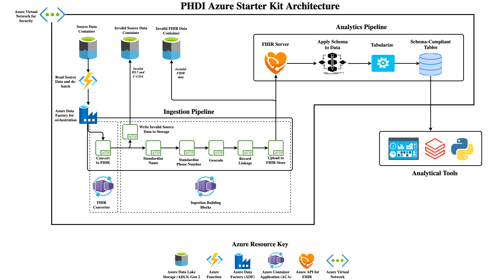
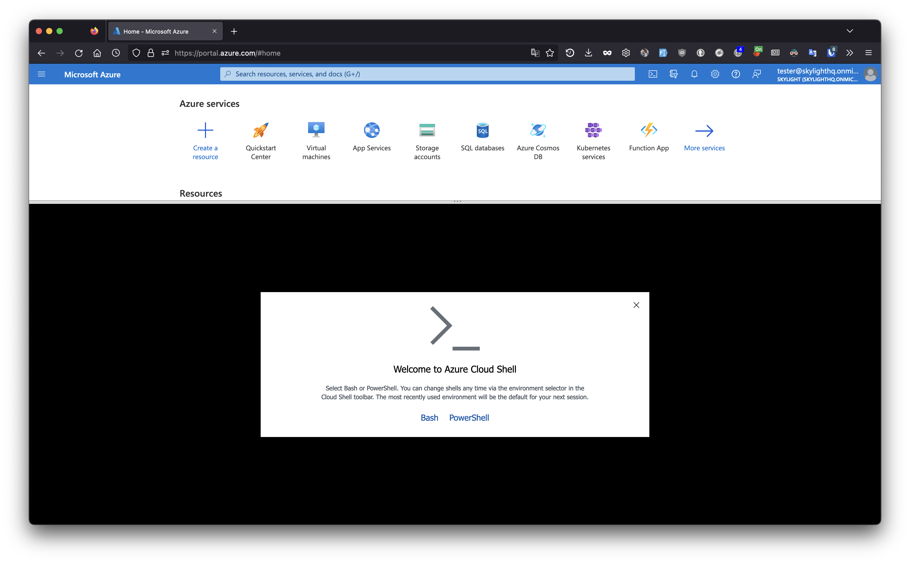
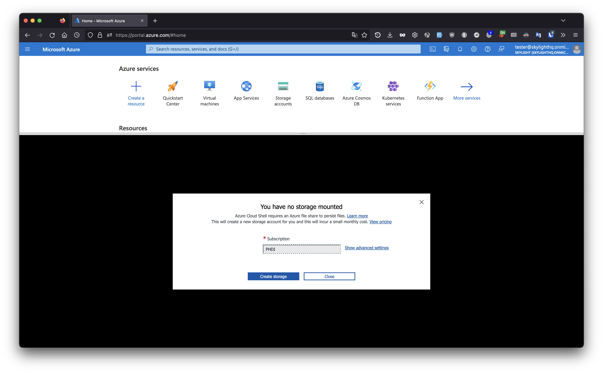
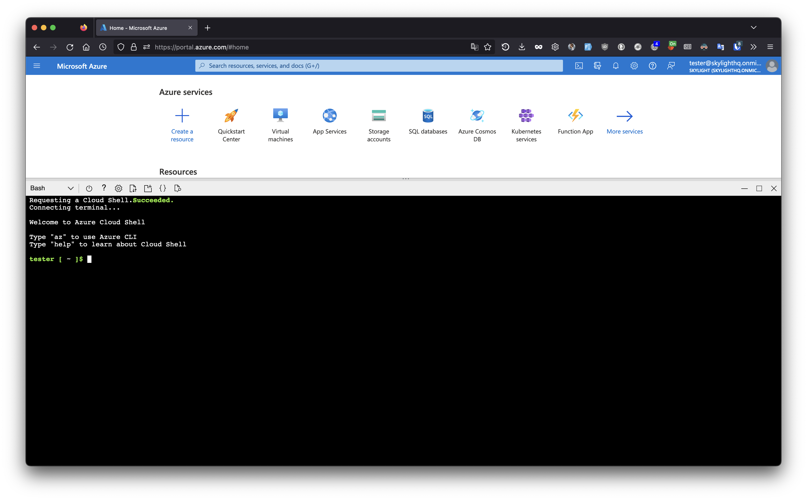
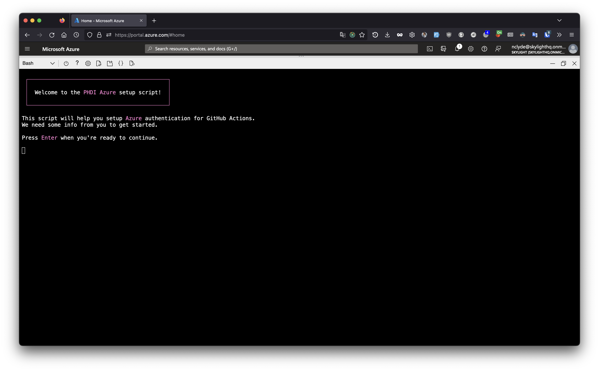
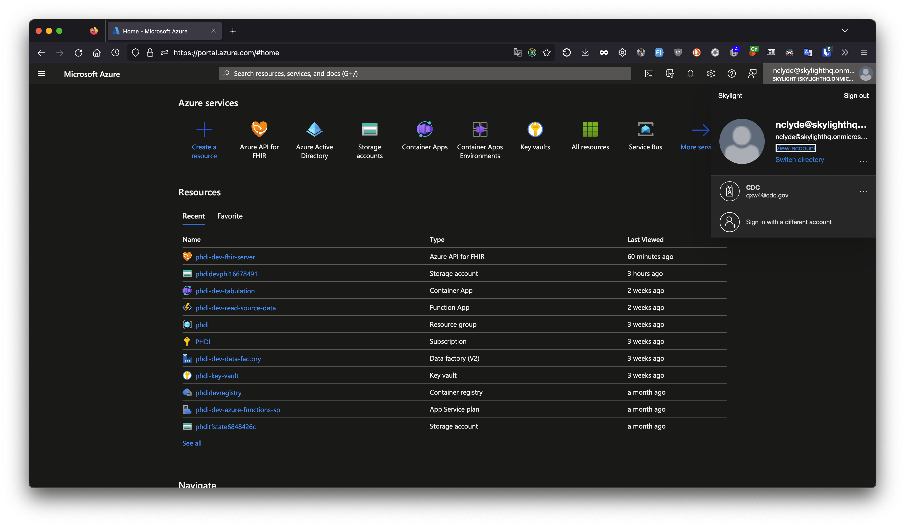
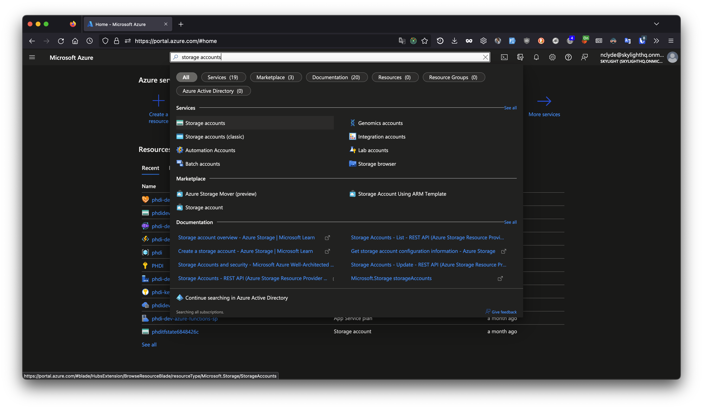
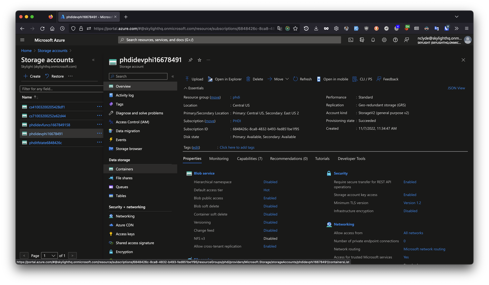
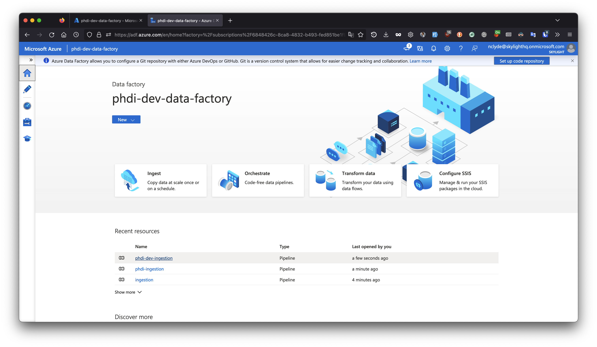
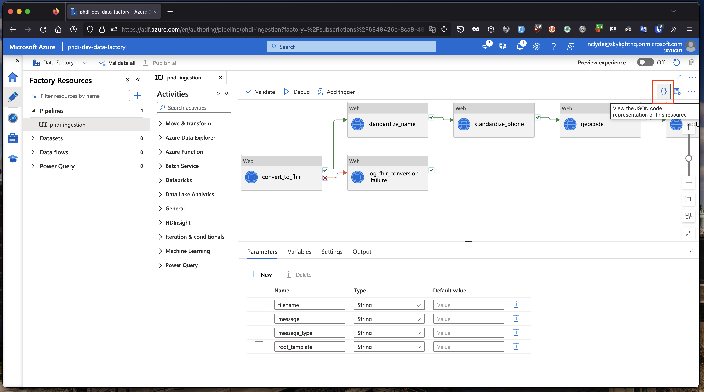

# PHDI Azure Implementation Guide

- [PHDI Azure Implementation Guide](#phdi-azure-implementation-guide)
    - [Introduction](#introduction)
        - [What is PHDI?](#what-is-phdi)
        - [What are Building Blocks?](#what-are-building-blocks)
        - [PHDI Starter Kit Architecture](#phdi-starter-kit-architecture)
            - [Ingestion Pipeline](#ingestion-pipeline)
            - [Analytics Pipeline](#analytics-pipeline)
        - [Additional References](#additional-references)
    - [Implementing the PHDI Azure Pipelines](#implementing-the-phdi-azure-pipelines)
        - [Step 1: Ensure you have collected values for geocoding variables](#step-1-ensure-you-have-collected-values-for-geocoding-variables)
        - [Step 2: Run the Quick Start Script in Azure Cloud Shell](#step-2-run-the-quick-start-script-in-azure-cloud-shell)
        - [Step 3: Run an Hl7v2 vaccination message through the pipeline](#step-3-run-an-hl7v2-vaccination-message-through-the-pipeline)

## Introduction
This document provides a detailed guide for implementing the PHDI pipelines provided in this repository.

### What is PHDI?
The Public Health Data Infrastructure (PHDI) project is part of the Pandemic-Ready Interoperability Modernization Effort (PRIME), a multi-year collaboration between CDC and the U.S. Digital Service (USDS) to strengthen data quality and information technology systems in state and local health departments. Under the PRIME umbrella the PHDI project seeks to develop tools, often referred to as Building Blocks, that State, Tribal, Local, and Territorial public health agencies (STLTs) can use to better handle the public health data they receive. The purpose of this repository is to implement the Building Blocks provided in the [PHDI library](https://github.com/CDCgov/phdi) on Azure. This will allow users to start using these Building Blocks easily in their own Azure environment.

### What are Building Blocks?
PHDI's goal is to provide STLTs with modern tools to solve challenges working with public health data. We refer to each of these tools as a "Building Block". Some Building Blocks offer relatively simple functionality, like standardizing patient names, while others perform more complex tasks, including geocoding and standardizing addresses. Importantly, the Building Blocks have been carefully designed with common inputs and outputs making them easily composable.  

### PHDI Starter Kit Architecture
The composable nature of Building Blocks allows them to be strung together into data pipelines where each Building Block represents a single step in a pipeline. As an example, let's consider a hypothetical case where a STLT would like to improve the quality of their patient address data and ensure that patient names are written consistently. They could solve this problem by using the name standardization and geocoding Building Blocks, mentioned in the previous section, to build a simple pipeline that standardizes patients' names and geocodes their addresses. Non-standardized data would be sent into the pipeline, where it would pass through each of the Building Blocks, and then exit the pipeline with standardized name and address fields. STLTs are welcome to use Building Blocks to create their own custom pipelines. However, because many STLTs face similar challenges processing data this repository implements a basic architecture in the form of a starter kit. The goal of this starter kit is to help STLTs easily get up and running with modern modular tooling for processing public health data in the cloud. We also fully understand that all STLTs do not face the same challenges. Our intention is for STLTs to modify and expand on this starter kit architecture to make it fit their specific needs. The starter kit has two main components: an ingestion pipeline that cleans and stores data in a FHIR server, and tabulation service that allows data to be easily extracted from the FHIR server. The complete architecture for the starter kit is shown in the diagram below.



#### Ingestion Pipeline
The ingestion pipeline is intended to allow STLTs to easily bring data that is reported to them into their system after performing standardizations and enrichments. Source data can be provided in either Hl7v2 or C-CDA formats allowing this single pipeline to manage ingestion of ELR, VXU, ADT, and eCR messages. The pipeline is able to support both data types because the initial step is to convert to FHIR. After this conversion the pipeline is able to handle all reported data the same way by simply processing the FHIR bundles, collections of FHIR resources, that result from the conversion. Once data has be converted to FHIR the following standardizations and enrichments are made:
1. Patient names are standardized.
2. Patient phone numbers are transformed into the ISO E.164 standard international format.
3. Patient addresses are geocoded for standardization and enrichment with latitude and longitude.
4. A hash based on a patient's name, date of birth, and address is computed to facilitate linkage with other records for the same patient.

After the data has been cleaned and enriched it is uploaded to a FHIR Store where it can serve as a single source of truth for all downstream reporting and analytics needs.

#### Tabulation Service
The tabulation service provides a mechanism for extracting and tabulating data from the FHIR server. Users define schemas describing the table(s) they would like to extract from the FHIR Store and submit them to the tabulation service. The service then conducts a basic Extract Transform and Load (ETL process) with the following steps:
1. Extraction - The service identifies the data required for a given schema and extracts it from the FHIR server using the FHIR API. 
2. Transform - The non-tabular and nested JSON FHIR data is transformed into the tabular format specified by the schema.
3. Load - The tabulated data is loaded into a flat file format (CSV, Parquet, or SQLite) and stored in an Azure File share. The data specified in the schema is now available downstream reporting and analytical workloads.

### Additional References
We have only provided a brief overview of PHDI, Building Blocks, and the pipelines we have designed. For additional information please refer to the documents linked below.
- [PHDI-azure README](./README.md)
- [PHDI-azure Getting Started Guide](./getting_started.md)

## Implementing the PHDI Azure Pipelines
In this section we describe how a STLT can take this repository and use it to spin up all of the functionality that it offers in their own Azure environment.

### User Assumptions
In order to proceed you will need either:
- an Azure account with permissions to create new resource groups in your organization's Azure environment,
or
- an Azure account with `Owner` access to a resource group in your organizations’ Azure environment that was created to house the PHDI Azure pipelines, and the name of this resource group.

If you do not meet either of these criteria contact the owner of your organization's Azure environment.

### Step 1: Ensure you have collected values for geocoding variables

Exiting the quick start script partway through is not recommended, so please have all values on hand when you run the script.

Required to use geocoding functionality:
- `SMARTY_AUTH_ID` - Your SmartyStreet Authorization ID. More info on the Smarty geocoding service [here](https://www.smarty.com/pricing/us-rooftop-geocoding)
- `SMARTY_AUTH_TOKEN` - Your SmartyStreet Authorization Token.

Keep these values easily accessible so that they can be entered later when the script prompts for them.

### Step 2: Run the Quick Start Script in Azure Cloud Shell
In this step we will work through Azure's [Workload Identity Federation](https://learn.microsoft.com/en-us/azure/active-directory/develop/workload-identity-federation) to grant your phdi-azure repo access to deploy the pipelines to your organization's Azure environment. We have provided a script to automate most of this process that we recommend you use. However, if you prefer to work through it manually you may follow [this guide](https://learn.microsoft.com/en-us/azure/active-directory/develop/workload-identity-federation-create-trust?pivots=identity-wif-apps-methods-azcli).

Navigate to the [Azure Cloud Shell](https://shell.azure.com/).  
  
Choose Bash as your shell environment:
  
  
Create storage for your Cloud Shell:  
  
  
When your shell is ready to receive commands, it will look like this:


To download and run the quick start script, run the following command in Cloud Shell:
```bash
git clone https://github.com/CDCgov/phdi-azure.git && cd phdi-azure && ./quick-start.sh
```

When the script is ready for your input, it will look like this:  
  
  
Press enter to begin the script.

If you plan to deploy to an existing resource group in your Azure environment, have the resource group name ready and provide it to the quick start script when prompted.

The script will take around 20-30 minutes to run.

### Step 3: Run an Hl7v2 vaccination message through the pipeline 
Now that the starter kit has been deployed we can run some data through it! The `sample-data/` directory in your forked version of the repository contains some dummy VXU messages that can be used to test the sucess and failure modes of the ingestion pipeline. To start, let's use `VXU_single_messy_demo.hl7` file that has a single VXU message. The PID segment of this message (shown below) contains some dirty data:
1. The patient's name is mixed case and contains a numeric character.
2. The patient's phone number is not in a standard format.
3. The patient's address is non-standard and has not been geocoded.

```diff
PID|1|7777555^4^M11^test^MR^University Hospital^19241011^19241012|PATID7755^5^M11^test1|PATID7758^^^test5|
- doe .^ John1 ^A.
|TEST^Mother, of^L|198505101126+0215|M||2106-3^White^HL70005|
- 555 E. 3065 S.^^Salt Lake CIty^ut^84106^USA
||
- 801-540-3661^^CP
|||M^Married||4880776||||N^NOT HISPANIC OR LATINO^HL70189||N||US^United States of America^ISO3166_1||||N|||20080110015014+0315|||||||
```

If you would like, feel free to confirm that this is the case by inspecting the file directly in the text editor of your choice. To run this message through the ingestion pipeline follow the steps below.

1. Open [https://portal.azure.com/](https://portal.azure.com/) in your browser.
1. Ensure that you are using the account that has access to the Azure resource group we have used so far.
1. Search for and select `Storage accounts` to view all of storage accounts we have deployed.
1. Select the PHI storage account, which is where all Protect Health Information is stored outside of the FHIR server. The precise name of the storage bucket will have the form `phdi{environment}phi{timestamp}`, eg `phdidevphi1667849158`.
1. View containers by clicking `Containers` in the sidebar on the left. 
1. Select the `source-data` container. 
1. Upload the `VXU_single_messy_demo.hl7` file from the `sample-data/` directory of your forked version of the repository to the `source-data/vxu/` directory of your PHI bucket. This can be done easily with the `Upload` button, clicking `Advanced`, typing `vxu` into the box labeled `Upload to folder`, and then clicking the blue button with a folder icon in the top left and choosing the file. Once the file is chosen, click the blue `Upload` button at the bottom of the left sidebar to finish the upload. Note that because the ingestion pipeline is event-driven, simply uploading the file is all that is required to trigger the pipeline. There is an event listener monitoring the PHI bucket for file creation events.
1. To see that the pipeline has executed search for `Data factories` and go to the Data factories page.
1. Select your data factory, which will be titled `phdi-{environment}-data-factory`.
1. Launch the Data Factory Studio by clicking the blue button that says `Launch studio`.
1. Select your ingestion pipeline, which will be titled `phdi-{environment}-ingestion`.
1. You should now see a diagram showing the steps of the pipeline. To view the status of our attempted run, click `Monitor` on the left sidebar.
1. We should now see that the ingestion pipeline has processed one message successfully.
1. To view the JSON configuration for the pipeline and a visualization of the process go to the `AUTHOR` tab.
1. To view the cleaned and enriched data in the FHIR server, visit https://shell.azure.com to open the Cloud Shell.
1. Type the command `az login` and press enter. Copy the code provided, click the link, and paste the code. Then follow the prompts to complete login.
1. To search for a patient named John Doe, enter the following commands, replacing `dev` with whichever environment you are currently searching in:
```bash
token=$(az account get-access-token --resource=https://phdi-dev-fhir-server.azurehealthcareapis.com --query accessToken --output tsv)
RESPONSE=$(curl -X GET --header "Authorization: Bearer $token" https://phdi-dev-fhir-server.azurehealthcareapis.com/Patient?family=DOE&given=JOHN)
echo $RESPONSE | jq
```


The table below describes the contents and expected ingestion pipeline behavior for each of the other files included in `sample-data/`. Feel free to try them out for yourself! 

| Test File | File Contents | Expected Outcome |
| --------- | --------------| ---------------- |
|VXU-V04-01_success_single.hl7| A single valid VXU message.|The ingestion pipeline will process a single message and upload it to the FHIR server.|
|VXU-V04-02_failedConversion.hl7| A single invalid VXU message that cannot be converted to FHIR.| The ingestion process will fail during the initial conversion to FHIR step. Information about the failure is written to `failed_fhir_conversion\vxu\`.
|VXU-V04-02_failedUpload.hl7| A single VXU message that converts to an invalid FHIR bundle.| The ingestion pipeline will fail during the final step when it attempts to upload the data to the FHIR server. Information about the failure is written to `failed_fhir_uploads\vxu\`.|
|VXU-V04-02_success_batch.hl7| A batch Hl7 message containing two valid VXU messages.| The ingestion pipeline is triggered twice and runs successfully to completion both times.|
|VXU-V04-03_batch_1_success_1_failConversion.hl7| A batch Hl7 message containing one valid and one invalid VXU message.| The ingestion pipeline will run twice. On one execution it successfully processes the data and uploads to the FHIR server. On the other execution it fails.|