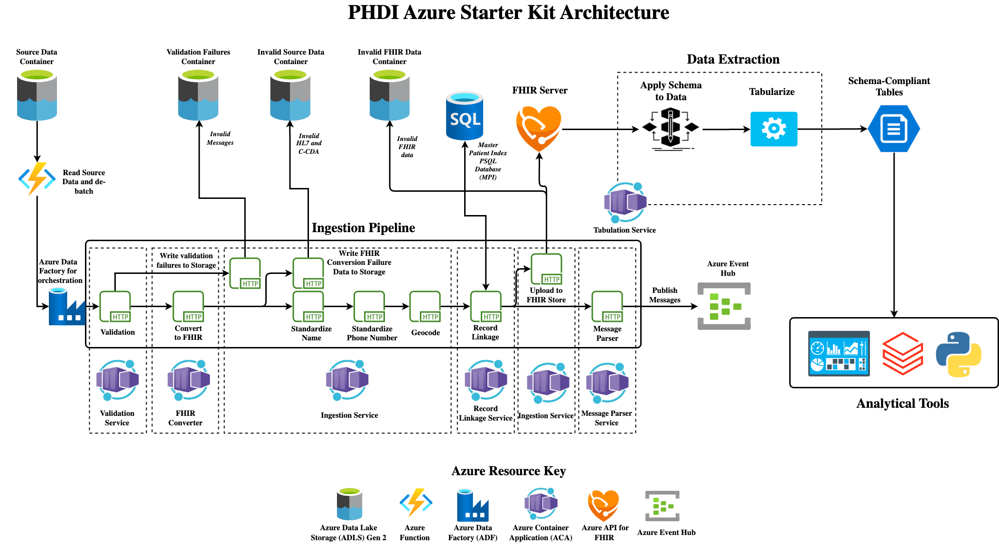

# PHDI Azure Implementation Guide

- [PHDI Azure Implementation Guide](#phdi-azure-implementation-guide)
    - [Introduction](#introduction)
        - [What is PHDI?](#what-is-phdi)
        - [What are Building Blocks?](#what-are-building-blocks)
        - [PHDI Starter Kit Architecture](#phdi-starter-kit-architecture)
            - [Ingestion Pipeline](#ingestion-pipeline)
            - [Tabulation Service](#tabulation-service)
        - [Additional References](#additional-references)
    - [Implementing the PHDI Azure Pipelines](#implementing-the-phdi-azure-pipelines)
        - [User Requirements](#user-requirements)
        - [Step 1: Ensure you have collected values for geocoding variables](#step-1-ensure-you-have-collected-values-for-geocoding-variables)
        - [Step 2: Run the Quick Start Script in Azure Cloud Shell](#step-2-run-the-quick-start-script-in-azure-cloud-shell)
        - [Step 3: Run an Hl7v2 vaccination message through the pipeline](#step-3-run-an-hl7v2-vaccination-message-through-the-pipeline)

## Introduction
This document provides a detailed guide for implementing the PHDI pipelines provided in this repository.

### What is PHDI?
The Public Health Data Infrastructure (PHDI) project is part of the Pandemic-Ready Interoperability Modernization Effort (PRIME), a multi-year collaboration between CDC and the U.S. Digital Service (USDS) to strengthen data quality and information technology systems in state and local health departments. Under the PRIME umbrella the PHDI project seeks to develop tools, often referred to as Building Blocks, that State, Tribal, Local, and Territorial public health agencies (STLTs) can use to better handle the public health data they receive. The purpose of this repository is to implement the Building Blocks provided in the [PHDI library](https://github.com/CDCgov/phdi) on Azure. This will allow users to start using these Building Blocks easily in their own Azure environment.

### What are Building Blocks?
PHDI's goal is to provide STLTs with modern tools to solve challenges working with public health data. We refer to each of these tools as a "Building Block". Some Building Blocks offer relatively simple functionality, like standardizing patient names, while others perform more complex tasks, including geocoding and standardizing addresses. Importantly, the Building Blocks have been carefully designed with common inputs and outputs making them easily composable.  

### PHDI Starter Kit Architecture
The composable nature of Building Blocks allows them to be strung together into data pipelines where each Building Block represents a single step in a pipeline. As an example, let's consider a hypothetical case where a STLT would like to improve the quality of their patient address data and ensure that patient names are written consistently. They could solve this problem by using the name standardization and geocoding Building Blocks, mentioned in the previous section, to build a simple pipeline that standardizes patients' names and geocodes their addresses. Non-standardized data would be sent into the pipeline, where it would pass through each of the Building Blocks, and then exit the pipeline with standardized name and address fields. STLTs are welcome to use Building Blocks to create their own custom pipelines. However, because many STLTs face similar challenges processing data this repository implements a basic architecture in the form of a starter kit. The goal of this starter kit is to help STLTs easily get up and running with modern modular tooling for processing public health data in the cloud. We also fully understand that all STLTs do not face the same challenges. Our intention is for STLTs to modify and expand on this starter kit architecture to make it fit their specific needs. The starter kit has two main components: an ingestion pipeline that cleans and stores data in a FHIR server, and tabulation service that allows data to be easily extracted from the FHIR server. The complete architecture for the starter kit is shown in the diagram below.



#### Ingestion Pipeline
The ingestion pipeline is intended to allow STLTs to easily bring data that is reported to them into their system after performing standardizations and enrichments. Source data can be provided in either Hl7v2 or C-CDA formats allowing this single pipeline to manage ingestion of ELR, VXU, ADT, and eCR messages. The pipeline is able to support both data types because the initial step is to convert to FHIR. After this conversion the pipeline is able to handle all reported data the same way by simply processing the FHIR bundles, collections of FHIR resources, that result from the conversion. Once data has be converted to FHIR the following standardizations and enrichments are made:
1. Patient names are standardized.
2. Patient phone numbers are transformed into the ISO E.164 standard international format.
3. Patient addresses are geocoded for standardization and enrichment with latitude and longitude.
4. A hash based on a patient's name, date of birth, and address is computed to facilitate linkage with other records for the same patient.

After the data has been cleaned and enriched it is uploaded to a FHIR Store where it can serve as a single source of truth for all downstream reporting and analytics needs.

#### Tabulation Service
The tabulation service provides a mechanism for extracting and tabulating data from the FHIR server. Users define schemas describing the table(s) they would like to extract from the FHIR Store and submit them to the tabulation service. The service then conducts a basic Extract Transform and Load (ETL process) with the following steps:
1. Extraction - The service identifies the data required for a given schema and extracts it from the FHIR server using the FHIR API. 
2. Transform - The non-tabular and nested JSON FHIR data is transformed into the tabular format specified by the schema.
3. Load - The tabulated data is loaded into a flat file format (CSV, Parquet, or SQLite) and stored in an Azure File share. The data specified in the schema is now available downstream reporting and analytical workloads.

### Additional References
We have only provided a brief overview of PHDI, Building Blocks, and the pipelines we have designed. For additional information please refer to the documents linked below.
- [PHDI-azure README](./README.md)
- [PHDI-azure Getting Started Guide](./getting_started.md)

## Implementing the PHDI Azure Pipelines
In this section we describe how a STLT can take this repository and use it to spin up all of the functionality that it offers in their own Azure environment.

### User Requirements
In order to proceed you will need:
1. `Owner` access to the Azure subscription where you would like to deploy the PHDI Starter Kit.
1. A GitHub account with a verified email address.
1. To be able to create new repositories in the GitHub account or organization where your copy of this repository will be created.
1. If you are planning to use an organization account, you must be able to authorize the GitHub CLI to interact with the organization.

If you do not meet either of these criteria contact the owner of your organization's Azure subscription and/or GitHub organization.

### Step 1: Ensure you have collected values for geocoding variables

Exiting the quick start script partway through is not recommended, so please have all values on hand when you run the script.

Required to use geocoding functionality:
- `SMARTY_AUTH_ID` - Your SmartyStreet Authorization ID. More info on the Smarty geocoding service [here](https://www.smarty.com/pricing/us-rooftop-geocoding)
- `SMARTY_AUTH_TOKEN` - Your SmartyStreet Authorization Token.

Keep these values easily accessible so that they can be entered later when the script prompts for them.

### Step 2: Run the Quick Start Script in Azure Cloud Shell
In this step we will work through Azure's [Workload Identity Federation](https://learn.microsoft.com/en-us/azure/active-directory/develop/workload-identity-federation) to grant your phdi-azure repo access to deploy the pipelines to your organization's Azure environment. We have provided a script to automate most of this process that we recommend you use. However, if you prefer to work through it manually you may follow [this guide](https://learn.microsoft.com/en-us/azure/active-directory/develop/workload-identity-federation-create-trust?pivots=identity-wif-apps-methods-azcli).

Navigate to the [Azure Cloud Shell](https://shell.azure.com/).  
  
Choose Bash as your shell environment:
  
  
Create storage for your Cloud Shell:  
  
  
When your shell is ready to receive commands, it will look like this:


To download and run the quick start script, run the following command in Cloud Shell:
```bash
git clone https://github.com/CDCgov/phdi-azure.git && cd phdi-azure && ./quick-start.sh
```

When the script is ready for your input, it will look like this:  
  
  
Press enter to begin the script.

If you plan to deploy to an existing resource group in your Azure environment, have the resource group name ready and provide it to the quick start script when prompted.

The script will take around 20-30 minutes to run.
