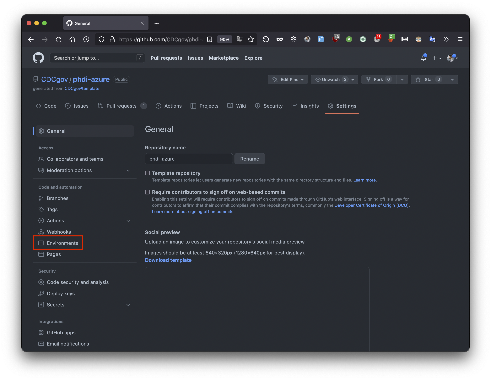
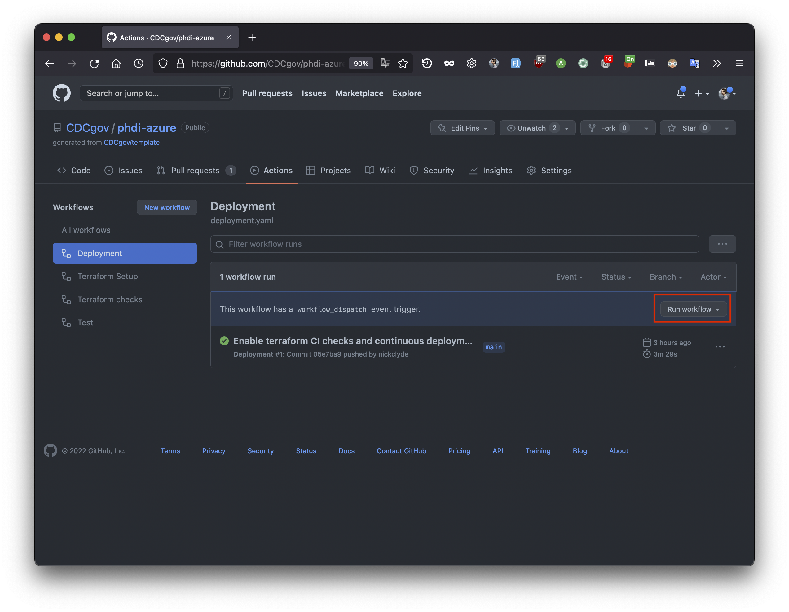

# PHDI Google Cloud Platform Implementation Guide

- [PHDI Google Cloud Platform Implementation Guide](#phdi-google-cloud-platform-implementation-guide)
    - [Introduction](#introduction)
        - [What is PHDI?](#what-is-phdi)
        - [What are Building Blocks?](#what-are-building-blocks)
        - [PHDI Pipelines](#phdi-pipelines)
            - [Ingestion Pipeline](#ingestion-pipeline)
            - [Analytics Pipeline](#analytics-pipeline)
        - [Additional References](#additional-references)
    - [Implementing the PHDI Google Cloud Platform Pipelines](#implementing-the-phdi-google-cloud-platform-pipelines)
        - [Step 1: Prepare Your GCP Environment](#step-1-prepare-your-gcp-environment)
        - [Step 2: Install the Gcloud CLI](#step-2-install-the-gcloud-cli)
        - [Step 3: Fork the phdi-google-cloud Repository](#step-3-fork-the-phdi-google-cloud-repository)
        - [Step 4: Clone the Forked Repository](#step-4-clone-the-forked-repository)
        - [Step 5: Run the Quick Start Script](#step-5-run-the-quick-start-script)
        - [Step 6: Set Repository Secrets](#step-6-set-repository-secrets)
        - [Step 7: Run the Terraform Setup GitHub Workflow](#step-7-run-the-terraform-setup-github-workflow)
        - [Step 8: Create a Development Environment](#step-8-create-a-development-environment)
        - [Step 9: Run the Deployment GitHub Workflow](#step-9-run-the-deployment-github-workflow)
        - [Step 10: Run End-to-end Functional Tests](#step-10-run-end-to-end-functional-tests)
    - [Estimated Costs](#estimated-costs)

## Introduction
This document provides a detailed guide for implementing the PHDI pipelines provided in this repository.

### What is PHDI?
The Public Health Data Infrastructure (PHDI) project is part of the Pandemic-Ready Interoperability Modernization Effort (PRIME), a multi-year collaboration between CDC and the U.S. Digital Service (USDS) to strengthen data quality and information technology systems in state and local health departments. Under the PRIME umbrella the PHDI project seeks to develop tools, often referred to as Building Blocks, that State, Tribal, Local, and Territorial public health agencies (STLTs) can use to better handle the public health data they receive. The purpose of this repository is to implement the Building Blocks provided in the [PHDI library](https://github.com/CDCgov/phdi-sdk) on Google Cloud Platform (GCP). This will allow users to start using these Building Blocks easily in their own GCP environment.

### What are Building Blocks?
PHDI's goal is to provide STLTs with modern tools to solve challenges working with public health data. We refer to each of these tools as a "Building Block". Some Building Blocks offer relatively simple functionality, like standardizing patient names, while others perform more complex tasks, including geocoding and standardizing addresses. Importantly, the Building Blocks have been carefully designed with common inputs and outputs making them easily composable.  

### PHDI Pipelines
The composable nature of Building Blocks allows them to be strung together into data pipelines where each Building Block represents a single step in a pipeline. As an example, let's consider a hypothetical case where a STLT would like to improve the quality of their patient address data and ensure that patient names are written consistently. They could solve this problem by using the name standardization and geocoding Building Blocks, mentioned in the previous section, to build a simple pipeline that standardizes patients' names and geocodes their addresses. Non-standardized data would be sent into the pipeline, where it would pass through each of the Building Blocks, and then exit the pipeline with standardized name and address fields. STLTs are welcome to use Building Blocks to create their own custom pipelines. However, because many STLTs are facing similar challenges with their data this repository implements two pipelines, developed by the PHDI team, centered around a GCP FHIR Store. The complete architecture for this system is shown in the diagram below.


#### Ingestion Pipeline
The ingestion pipeline is intended to allow STLTs to easily bring data that is reported to them into their system after performing standardizations and enrichments. Source data can be provided in either Hl7v2 or C-CDA formats allowing this single pipeline to manage ingestion of ELR, VXU, ADT, and eCR messages. The pipeline is able to support both data types because the inital step is to convert to FHIR. After this conversion the pipeline is able to handle all reported data the same way by simply processing the FHIR bundles, collections of FHIR resources, that result from the conversion. Once data has be converted to FHIR the following standardizations and enrichments are made:
1. Patient names are standardized.
2. Patient phone numbers are transformed into the ISO E.164 standard international format.
3. Patient addresses are geocoded for standardization and enrichment with latitude and longitude.
4. A hash based on a patient's name, date of birth, and address is computed to facilitate linkage with other records for the same patient.

After the data has been cleaned and enriched it is uploaded to a FHIR Store where it can serve as a single source of truth for all downstream reporting and analytics needs.

#### Analytics Pipeline
The analytics pipeline provides a mechanism for extracting and tabularizing desired data from the FHIR Store. Users define schemas describing the table(s) they would like from the FHIR Store and submit them to the analytics pipeline. The pipeline then interprets the schemas, queries the FHIR for the necessary data, transforms the un-structured FHIR resources into tables, and makes these tables available for reporting and analysis.

### Additional References
We have only provided a brief overview of PHDI, Building Blocks, and the pipelines we have designed. For additional information please refer to the documents linked below.
- [PHDI-google-cloud README](./README.md)
- [PHDI-google-cloud Getting Started Guide](./getting_started.md)

## Implementing the PHDI Google Cloud Platform Pipelines
In this section we describe how a STLT can take this repository and use it to spin up all of the functionality that it offers in their own GCP environment.

### Step 1: Prepare Your GCP Environment
In order to proceed you will need either:
- a GCP account with permissions to create new projects in your organization's GCP environment,
or
- a GCP account with `Owner` access to a project in your organizations’ GCP environment that was created to house the PHDI GCP pipelines, and the name of this project.

If you do not meet either of these criteria contact the owner of your organization's GCP environment.

### Step 2: Install the Gcloud and GitHub CLI tools
The gcloud CLI is a command line tool provided by Google for working with GCP. We will use it to authenticate your local machine with your organization's GCP environment. Follow [this guide](https://cloud.google.com/sdk/docs/install) to install `gcloud`. Confirm that the installation was successful by running `gcloud --version`. If `gcloud` is installed properly you should get a response similar to what is shown below.

```bash
❯ gcloud --version
Google Cloud SDK 399.0.0
bq 2.0.75
core 2022.08.19
gsutil 5.12
```

Optionally, you may also install the GitHub CLI tool (`gh`) to enable automatically setting secrets in your repository. Follow [this guide](https://cli.github.com/manual/installation) to install the tool. Confirm that the installation was successful by running `gh --version`. If `gh` is installed properly you should get a response similar to what is shown below.

```bash
❯ gh --version
gh version 2.14.7 (2022-08-25)
https://github.com/cli/cli/releases/tag/v2.14.7
```

### Step 3: Fork the phdi-google-cloud Repository
Fork the phdi-google-cloud repository into your organization's, or your personal, GitHub account.
1. Navigate to [https://github.com/CDCgov/phdi-google-cloud](https://github.com/CDCgov/phdi-google-cloud).
2. Click on the `Fork` button in the top right.

3. Select the owner of the forked repository. We recommend that this is an organization and not an individual.
4. Click `Create fork` at the bottom of the page.


### Step 4: Clone the Forked Repository
Clone the forked version of the phdi-google-cloud repository by running `git clone https://github.com/<MY-GITHUB-ORGANIZATION>/phdi-google-cloud.git`. If you do not have `git` installed please follow [this guide](https://github.com/git-guides/install-git) to install it.

### Step 5: Run the Quick Start Script
In this step we will work through GCP's [Workload Identity Federation](https://cloud.google.com/iam/docs/workload-identity-federation) to grant your phdi-google-cloud repo access to deploy the pipelines to your organization's GCP environment. We have provided a script to automate most of this process that we recommend you use. However, if you prefer to work through it manually you may follow [this guide](https://github.com/google-github-actions/auth#setup).

From your machine's command line:
1. Navigate to the root directory of the repository you cloned in step 4.
2. Run the quick start script and follow the prompts.
    - [quick-start.sh](../quick-start.sh) for Mac and Linux
    - [quick-start.ps1](../quick-start.ps1) for Windows

If you plan to deploy to an existing project in your GCP environment, have the project name ready and provide it to the quick start script when prompted.

### Step 6: Set Repository Secrets
If you installed the `gh` CLI and the quick start script set these secrets automatically, you may skip to Step 7.

Set the following secret values in your forked phdi-google-cloud repository:
- `PROJECT_ID` - Specified by the quick start script.
- `SERVICE_ACCOUNT_ID` - Specified by the quick start script.
- `WORKLOAD_IDENTITY_PROVIDER` - Specified by the quick start script.
- `REGION` - Your choice of GCP region; quick start script suggests `us-central1`.
- `ZONE`- Your choice of GCP zone; quick start script suggests `us-central1-a`.

Information about GCP regions and zones is available [here](https://cloud.google.com/compute/docs/regions-zones).

If your project will utilize the geocoding functionality you will need to set these secret values in your forked phdi-google-cloud repository:
- `SMARTY_AUTH_ID` - Your SmartyStreet Authorization ID.
- `SMARTY_AUTH_TOKEN` - Your SmartyStreet Authorization Token.


To create a repository secret follow these steps.
1. Navigate to `https://github.com/<MY-GITHUB-ORGANIZATION>/phdi-google-cloud` in your browser.
2. Click on `Settings` in the top right.

3. Click on `Secrets` and then `Actions` in the bottom left.

4. Click on `New repository secret`.

5. Fill in `Name` and `Value` fields and then click `Add secret`.


### Step 7: Run the Terraform Setup GitHub Workflow
In order for Terraform to deploy the PHDI pipelines, it needs a place to store the "state" of your GCP project. In this context "state" is simply a record of the current configuration of the project. In the first stage of a deployment Terraform compares the configuration specified in the `terraform/` directory of your forked phdi-google-cloud repository to the current state of your GCP project. In the second stage Terraform makes the necessary changes to resolve any differences and align the GCP project with the repository. To create a GCP storage bucket for storing the state of your GCP project run the `Terraform Setup` GitHub Workflow. For additional information on state please reffer to [this documentation](https://www.terraform.io/language/state) from Terraform.

To run `Terraform Setup` follow the steps below.
1. Navigate to `https://github.com/<MY-GITHUB-ORGANIZATION>/phdi-google-cloud` in your browser.
2. Click on `Actions` near the center at the top of the page.

3. Select `Terraform Setup` from the list of Workflows on the left side of the screen.

4. Click on `Run workflow` in the middle of the right side of the screen.

5. Ensure the `main` branch is selected and click the green `Run workflow` button.


### Step 8: Create a Development Environment
Your forked version of the phdi-google-cloud repository can deploy multiple instances of the PHDI pipeline infrastructure to your GCP project, each managed by its own [terraform workspace](https://www.terraform.io/language/state/workspaces). This allows you to easily create and maintain instances of the PHDI pipelines dedicated for distinct purposes like development, testing, and production. We recommend that your organization maintain at least two instances of the PHDI pipelines, one for production and at least one other for development and testing purposes. Each instance of the PHDI pipelines is associated with a GitHub Environment. To create a new Environemnt in your forked version of the phdi-google-cloud respository follow the steps below.

To create a repository secret follow this steps.
1. Navigate to `https://github.com/<MY-GITHUB-ORGANIZATION>/phdi-google-cloud` in your browser.
2. Click on `Settings` in the top right.

3. Click on `Environments` in the middle of the left side of the screen.

4. Click on `New environment` in the top right.

5. Enter a name for your development environment (e.g. `dev`) and click `Configure environment`. No additional configuration of the environment is required at this time you proceed to step 9.


### Step 9: Run the Deployment GitHub Workflow
At this point we have completed all of the necessary setup. We are now ready to deploy the PHDI pipelines to your GCP project with Terraform via the provided `Deployment` GitHub Workflow. To run this workflow to deploy the PHDI pipelines to the development environment you created previously, follow the steps below.

1. Navigate to `https://github.com/<MY-GITHUB-ORGANIZATION>/phdi-google-cloud` in your browser.
2. Click on `Actions` near the center at the top of the page.

3. Select `Deployment` from the list of Workflows on the left side of the screen.

4. Click on `Run workflow` in the middle of the right side of the screen.

5. Ensure the `main` branch is selected and choose the environment you wish to deploy to and click the green `Run workflow` button. In the screenshot below we are deploying to our development environment which we have called `dev` 


### Step 10: Run End-to-end Functional Tests
TODO: Design some basic tests and describe how to run them here.

## Estimated Costs
TODO: Conduct cost analysis for the ingestion pipeline.


