# Azure Pipeline Troubleshooting Guide

- [Azure Pipeline Troubleshooting Guide](#azure-pipeline-troubleshooting-guide)
    - [Overview](#overview)
    - [Azure Data Factory Studio](#azure-data-factory-studio)
      - [Getting to the Studio](#getting-to-the-adf-studio)
      - [Monitoring your pipeline runs and diagnosing issues](#monitoring-your-pipeline-runs-and-diagnosing-issues)
      - [Troubleshooting pipeline configuration issues](#troubleshooting-pipeline-configuration-issues)
    - [Observing Pipeline Failure Trends using the Dashboard](#observing-pipeline-failure-trends-using-the-dashboard)

## Overview
This guide provides an overview of basic pipeline failure troubleshooting in Microsoft Azure. It assumes a user
has an account with full access to their Azure environment and basic familiarity with some Azure concepts. Full
Azure docs can be found [here.](https://learn.microsoft.com/en-us/azure/?product=popular)

## Azure Data Factory Studio
Our primary window into what's happening in our pipelines is the Azure Data Factory Studio. It provides a GUI
allowing management, monitoring, and editing of pipelines in a resource group without having to redeploy. This tool is 
where most of our Azure troubleshooting will take place, though it can be a bit tough to find.

### Getting to the ADF Studio
Start by navigating to Azure and logging in to your account. Once you've done that
follow the steps below.
 
 
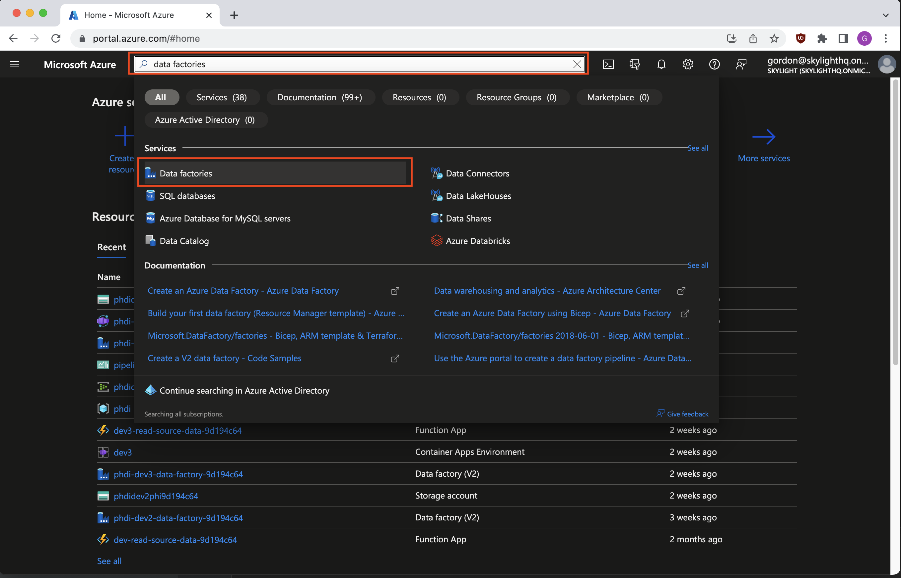
<figcaption align = "center">From the Azure homepage, search at the top for data factories and select it from the dropdown.
</figcaption>

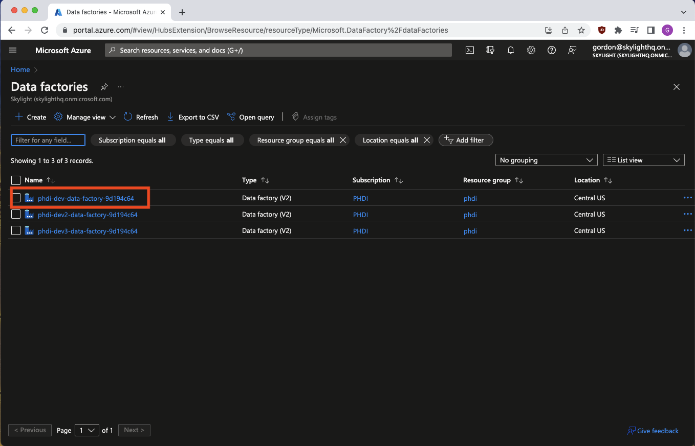
<figcaption align = "center">Select the Data Factory that contains the pipeline you want to troubleshoot.
</figcaption>

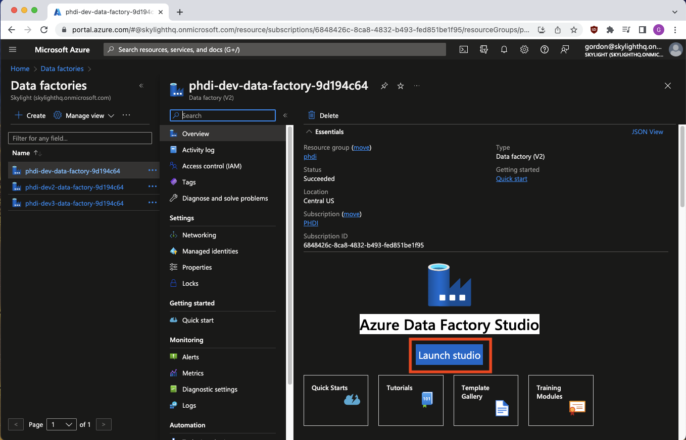
<figcaption align = "center">Click Launch Studio.
</figcaption>

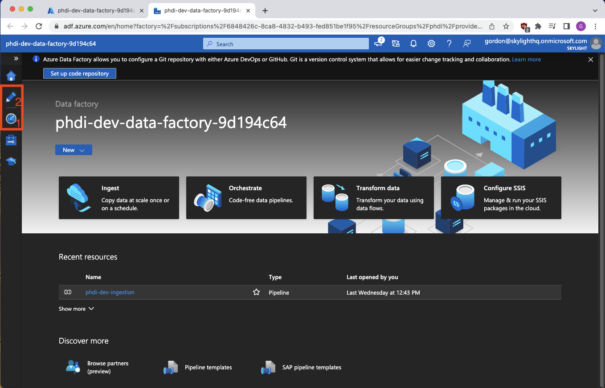
<figcaption align = "left">We're now in the Azure Data Factory Studio, and we have two options of where to go depending
on if we're primarily troubleshooting pipeline run failures or pipeline configuration issues. More info on telling these
issues apart in the next section. The radar icon marked #1 opens a pipeline monitoring tool while the pencil at #2 opens an interface
allowing pipeline config edits.Let's look at monitoring first.
</figcaption>

### Monitoring your pipeline runs and diagnosing issues
Clicking the radar button takes us to the following informative page.

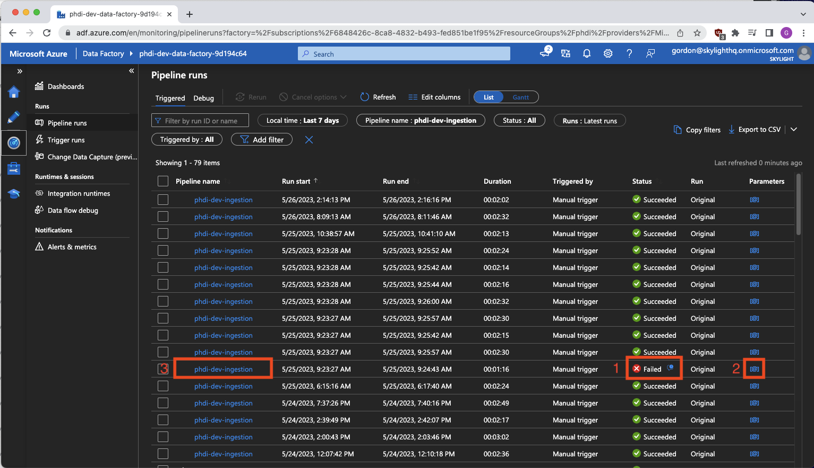
<figcaption align = "left">Here we can see and sort all pipeline runs. The status column gives us
at-a-glance feedback for if we've had any issues with runs. It's also where we'll get a read on whether we have a problem
with an individual run, a batch of messages, or a problem with the pipeline as a whole. Lone failures indicate a likely issue with the specific
file uploaded for that run. Many successive failures, especially if all fail on a particular step in the pipeline, likely indicate a pipeline
configuration issue or a problem in a building block. Orange box #1 is an example of a failed pipeline run. This is also the first place where we can see some error
messaging by clicking the small blue icon by the word "Failed". However, I don't recommend 
troubleshooting from here as the error formatting is poor and we're lacking important context. One important thing you can
learn on this page is the name of the file associated with each run. In orange box #2 there's an @ in square brackets which
can be clicked to see the parameters fed into the pipeline for that particular run, once of which is the name of the uploaded file.
To get even more debugging info for a run, click the blue pipeline name link on the left, orange box #3. This takes us to a much more detailed and useful
view of the failed run.
</figcaption>

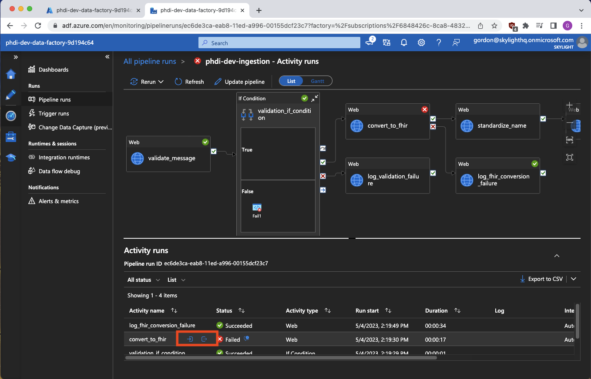
<figcaption align = "left"><b>This run details page is the most useful place for diagnosing the cause of a failure.</b> We have full context showing us exactly
which steps succeeded or failed, and, most importantly, inputs and outputs of the failed step. The inputs/outputs are shown
by clicking the small blue icons highlighted in the orange box. However, you won't see these icons on initial page load because, for some
reason, Azure decided they should only appear on hover or click of the failed step in the lower list. The blue output icon
on the right will contain the most readably formatted version of the failure error you can find, and inputs from the left
blue icon can be checked against expected values.
</figcaption>

### Troubleshooting pipeline configuration issues
Pipeline configuration problems can be somewhat trickier to track down, and generally use a combination of the ADF studio
monitoring page we explored in the last section, and the Author page found through the aforementioned pencil icon. Let's
go there now.

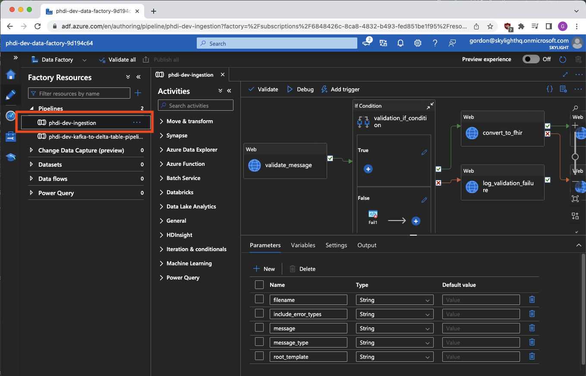
<figcaption align = "left">Once you've clicked the pencil and gotten to the Author tool, select your pipeline on the left to get this detailed view.
This page is extremely powerful and gives us complete control over examining and editing the pipeline configuration without
having to make changes in an IDE, pushing, and redeploying the entire pipeline. A handy graphical representation of our 
pipeline shows us how everything is related as well as general pipeline config such as params and variables in the bottom middle.
</figcaption>

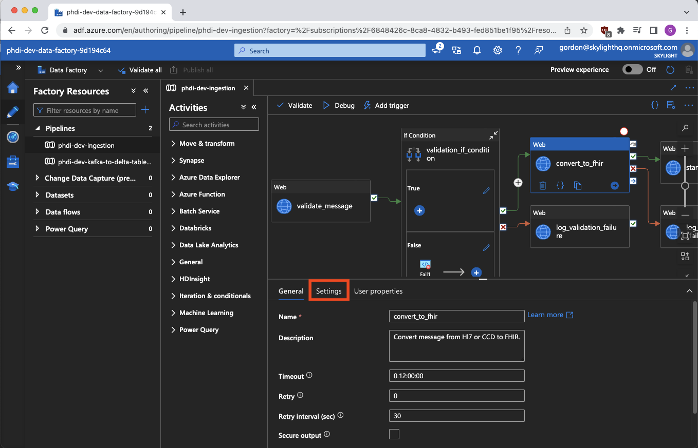
<figcaption align = "left">Clicking a particular pipeline step highlights it in blue and changes the lower portion of the page into a detailed job
view. Here we can tinker with individual settings and try changes to fix issues which might arrive. The settings tab in
particular (highlighted in orange) can help us get a better idea of what a job is up to.
</figcaption>

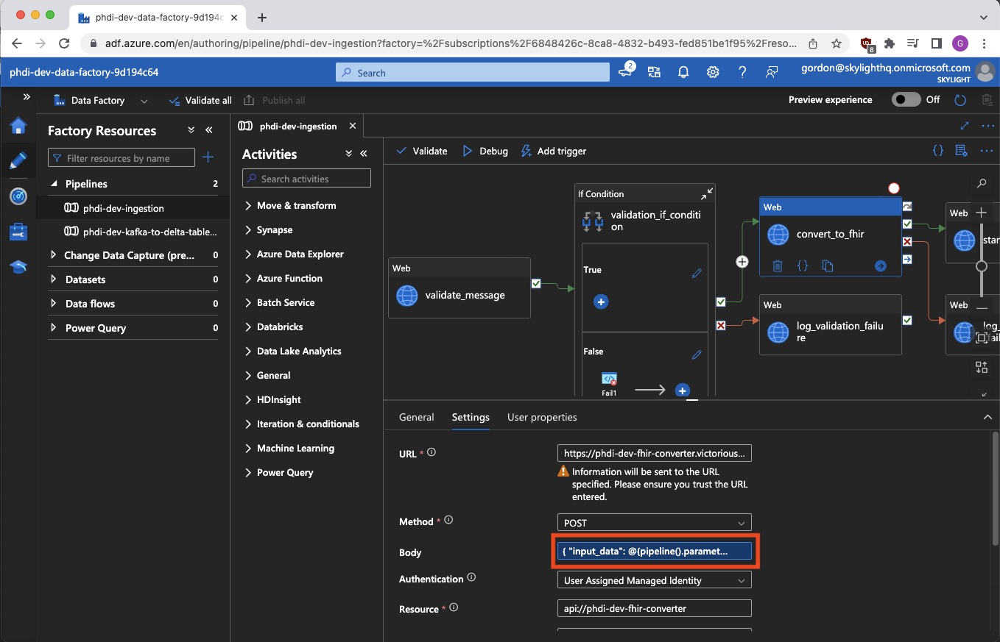
<figcaption align = "left">These settings are where you're most likely to find something about a particular pipeline step misconfigured. Here we
can see if it's hitting the right URL, using the right method, how the request body is being formed, headers, and 
credentials. Clicking a particular field will allow you to make changes or, in some cases, take you to a detailed edit view.
</figcaption>

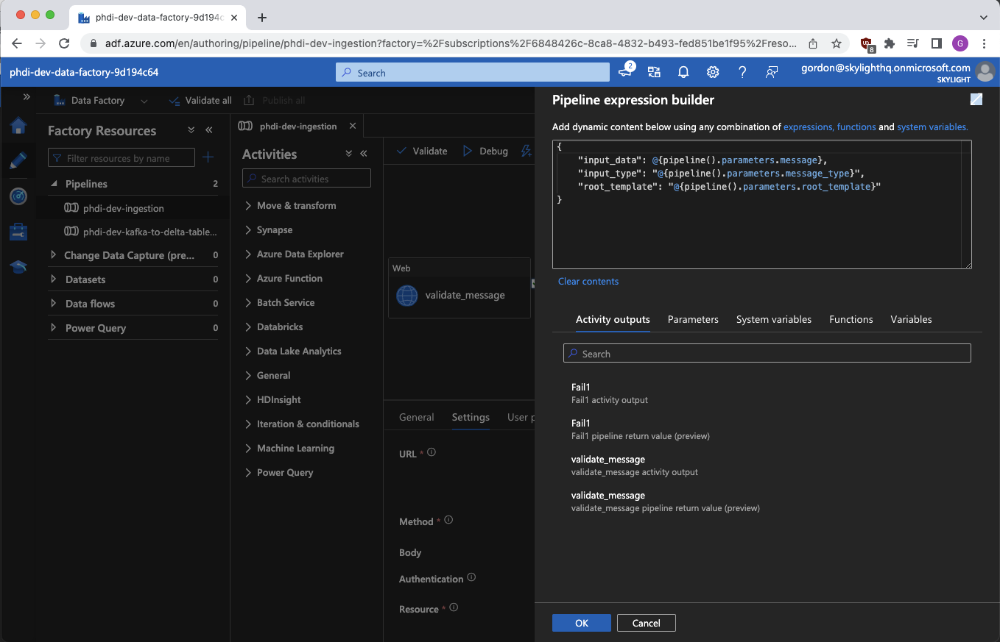
<figcaption align = "center">For example this edit view for the body field is both more readable and where we can actively adjust these values.
</figcaption>

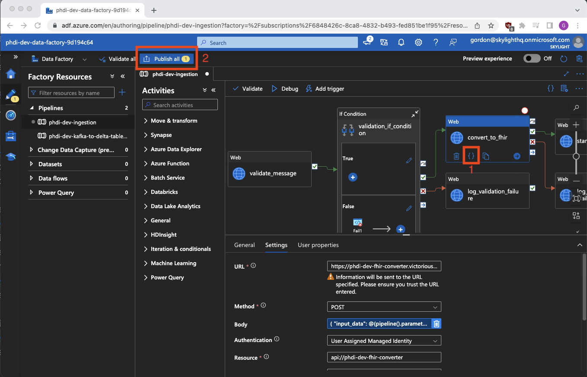
<figcaption align = "left">Two final important notes for the Author section of ADF Studio: First, orange box 1 highlights a pair of curly braces you can click to see the source code of a particular
step in the pipeline. While you can't edit from this view, it does put all the info for a step in front of you in a format
similar to the Terraform config files you might be comparing to in your IDE. Second, orange box 2 highlights the publish button.
Any changes you make in the author tool are only a draft until you click here, at which point they are put into effect immediately.
BE CAREFUL. The author tool is powerful and you can very easily <b><i>break things</i></b> in your pipeline.
</figcaption>

## Observing Pipeline Failure Trends Using the Dashboard
Our deployment script also automatically sets up a monitoring dashboard in Azure giving visibility into pipeline pass/fail
trends over time. To access this use the following directions.

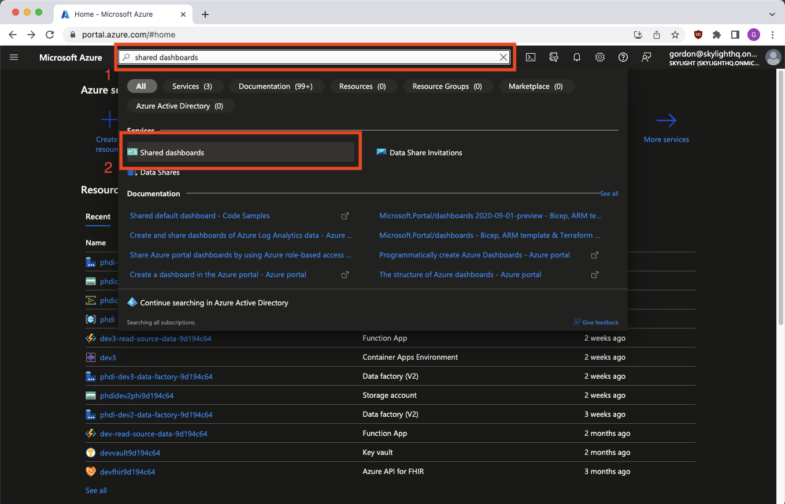
<figcaption align = "left">From the Azure homepage, search for "shared dashboards" in the search bar. Click the corresponding option in the dropdown.
</figcaption>

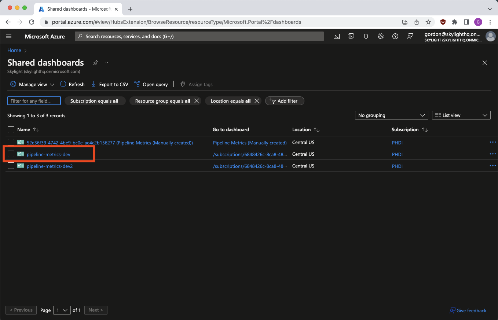
<figcaption align = "left">Select your resource group from the list.
</figcaption>

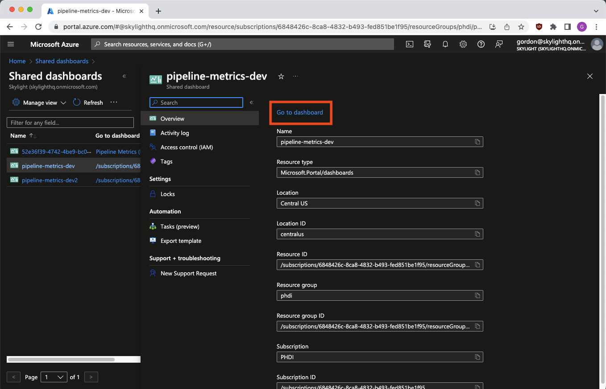
<figcaption align = "center">Click the small blue "Go to dashboard" link.
</figcaption>

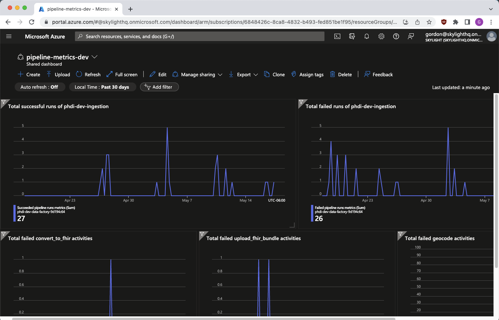

Here we have several graphs showing whole pipeline passes, whole pipeline fails, and three graphs showing failures of
specific steps (Convert to FHIR, Upload FHIR bundle, and Geocode). Using the filters above the graphs we can adjust date
ranges to observe failure trends over time. This is useful for pinpointing a date when a bug was introduced etc. More info
on creating and editing dashboards can be found [here](https://learn.microsoft.com/en-us/azure/azure-portal/azure-portal-dashboards).

## readSourceData
readSourceData is a serverless function that we use to trigger the pipeline whenever new data is uploaded. It is responsible for making the starter kit event-driven, meaning that data is processed through the pipeline in real-time as it is received.

### How it works
The source code for readSourceData can be found in the `phdi-azure` repo at `phdi-azure/serverless-functions/readSourceData`. The main file to be concerned with is `__init__.py`. 

Azure Event Grid is used to trigger readSourceData whenever new files are created in the `source-data` container in the `phi` storage account. As currently configured, when a new file is created in any of the `elr, vxu, and ecr` directories within `source-data` readSourceData will read the contents and trigger the pipeline. In addition to trigger the pipeline readSourceData servers 3 important pre-processing functions.
1. Based on the directory where new data is uploaded it determines the appropriate template for the FHIR converter to use when converting the incoming data to FHIR.
2. If a batch Hl7v2 message is uploaded to `elr, or vxu` readSourceData will de-batch the message and trigger the pipeline once for each individual message.
3. When an eICR file is uploaded to `ecr` readSourceData will attempt to find the corresponding reportability response (RR). If a one can be found the contents from the eICR and RR are merged into a single XML document and sent off to the pipeline for conversion to FHIR and downstream processing. By default if a corresponding RR cannot be found readSourceData will raise and exception and fail. However, if you would like to allow processing of eICRs without their RRs you may set the `REQUIRE_RR` environment variable to `false`.
It is important to ensure that data is uploaded to the appropriate subdirectory to ensure that readSourceData handles the incoming messages appropriately and provides the correct information to the pipeline for appropriate conversion to FHIR.

### Environment Variables
The following is a table with all environment variables that affect readSourceData and what each one does in this context.

| Name                                  | Description                                                                        |
|---------------------------------------|------------------------------------------------------------------------------------|
| WAIT_TIME                             | How long the app will poll for ecr related RR data. Default: 10 seconds            |
| SLEEP_TIME                            | The time the RR function will sleep before checking for RR data. Default: 1 second |
| AZURE_SUBSCRIPTION_ID                 | The Azure subscription ID.                                                         |
| RESOURCE_GROUP_NAME                   | The name of the resource group in which to create the resources.                   |
| FACTORY_NAME                          | The name of the PHDI ADF resource.                                                 |
| PIPELINE_NAME                         | The name of the ingestion pipeline in ADF.                                         |

### Troubleshooting
1. The first thing to check is that a file was uploaded to the correct container. Files should be uploaded to `source-data/(elr|vxu|ecr)`. 

Also verify that `ecr` files have their associated `RR` files. 

2. Check logs

Logs can be found by navigating to azure portal, select the resource group where your app is deployed. Then filter to `function app`. The app should be called `{environment}-read-source-data-{id}`.

From the overview page, you can view aggregations of `readSourceData` runs and if they've failed or not.

In the side bar, selecting `Functions` and then `readSourceData` and then `Monitor` will show you the various runs of the function.

From here you can select various runs. If a run has failed, a red error message will be shown in the `Success` column. Selecting these runs will show you logs from that run. 

Here you can review logs for specific error messages about runs, and address the problems from there. 

## CLI Logs
You can use the command line to view logs in real time, and view historic activity logs. This can help you troubleshoot issues that may occur.

### Prerequisites
- In order to view logs with the CLI, you will need to have the [azure CLI installed](https://learn.microsoft.com/en-us/cli/azure/install-azure-cli) on your system. 
- Log into Azure `az login`
 - This will open a web page allowing you to login.

### Commands
- Activity logs for the entire resource group
  - `az monitor activity-log list -g {resource group name} --offset {1h, 2d, etc}`
  - Flags
    - `-g`,`--resourcegroup` Name of resource group
    - `--tail` Number of past logs to print. (0-300)
- Logs for a specific app container, revision, or replica. Note: this only works on running containers. Running the command will spin up a new container.
  - `az containerapp logs show -g {resource group name} -n {name of container app} --offset {1h, 2d, etc}`
  - Flags
    - `-g`,`--resourcegroup` Name of resource group
    - `-n`,`--name` Name of container app
    - `--offset` Time offset of the query range, in ##d##h format. default value: 6h
    - `--follow` Follow logs in real time. Accepts `true, false`

### Resources
- [Activity log](https://learn.microsoft.com/en-us/azure/azure-monitor/essentials/activity-log?tabs=powershell)
- [Conatiner app logs](https://learn.microsoft.com/en-us/cli/azure/containerapp/logs?view=azure-cli-latest#az-containerapp-logs-show)

